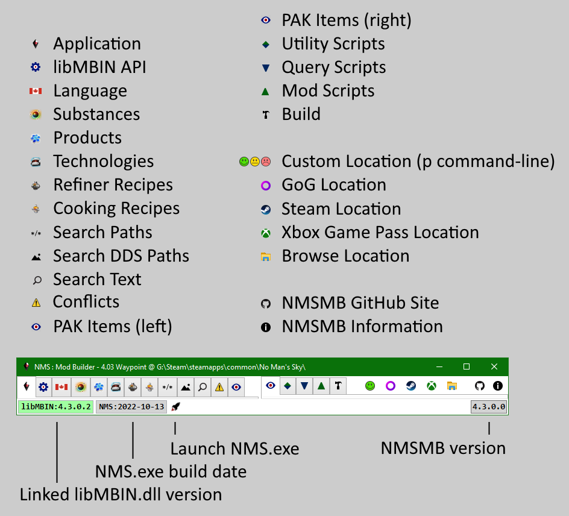

# Quick Start

---

## Install
Requires [.NET Desktop Runtime 8.x x64](https://dotnet.microsoft.com/download/dotnet/8.0) to be installed for versions 5 and greater. 
e.g. https://dotnet.microsoft.com/en-us/download/dotnet/thank-you/runtime-desktop-6.0.10-windows-x64-installer

[Download the latest release](https://github.com/cmkushnir/NMSModBuilder/releases/latest/download/NMSModBuilder.7z) and unzip.
There is no installer, the 7z contains a NMSModBuilder folder with all the application contents, including default scripts.
Don't unzip a new version over an existing instance.

>A given NMSMB version can only roll the libmbin.dll version forward.
>For example, NMSMB version 4.0.0.0 comes with libmbin 4.0.0.2,
>you can only try to replace the included libmbin with newer versions like 4.0.0.3,
>you can not use older versions like 4.0.0.1.
>If your game release needs an older libmin then you need to use an older NMSMB version that supports it.
>Look in the NMSMB change.log to see what libmbin version is included with each NMSMB version,
>or just check the libmbin in the download file.

---

## Start
- Run `.../NMSModBuilder/cmkNMSModBuilder.exe`. 
- Click a game location toolbar button to load the data for the game instance.

---

## Research
The left set of tabs are for research.

### [Application](../Tab/Application/Readme.md)
Default log window and NMSMB state toggle buttons.

### [libMBIN API](../Tab/MBINC/Readme.md)
All Enums, Structs, Fields from linked libMBIN.dll. 
Top-level structs have links to mbin's that use them. 
Can filter displayed items using wildcard or regex pattern.

### [Language](../Tab/Language/Readme.md)
Consolidated and sorted list of all ID - Text pairs for the selected language. 
The selected language is used to display Text in all tabs that use a language ID. 
Can filter displayed items using wildcard or regex pattern.

### [Substances, Products, Technologies](../Tab/Items/Readme.md)
List items from corresponding `METADATA/REALITY/TABLES/*.MBIN`. 
For each item display Icon, ID's, Text, Description, Requirements. 
Can filter displayed items using wildcard or regex pattern.

### [Refiner and Cooking Recipes](../Tab/Recipes/Readme.md)
List items from `METADATA/REALITY/TABLES/NMS_REALITY_GCRECIPETABLE.MBIN`. 
For each item display Icons, ID's, Text, Description, Requirements. 
Can filter displayed items using wildcard or regex pattern.

### [Search Paths](../Tab/SearchPaths/Readme.md)
Use wildcard or regex pattern to search all item paths in game or mod pak files.

### [Search DDS Paths](../Tab/SearchDds/Readme.md)
Use wildcard or regex pattern to search all *.dds paths in game or mod pak files. 
A thumbnail image is displayed for each result.

### [Search Text](../Tab/SearchText)
Use wildcard or regex pattern to search items in game or mod pak files that can be represented as text. 
Optionally cache mbin text to significantly speed up subsequent searches.

### [PAK Conflicts](../Tah/PakConflicts/Readme.md)
Only displayed if conflicts are detected. 
NMSMB watches the selected game `GAMEDATA/PCBANKS/MODS/` folder for *.pak adds | deletes | changes.
Whenever a change is detected it rechecks for conflicts, and displays the tab if any are found, otherwise it hides the tab.

### [PAK Items](../Tab/PakItems/Readme.md)
View items in game or mod pak files.  Can save items to disk. 
Specialized viewers and diff viewers for common item types e.g. mbin, dds, spv, txt, ... .

---

## [Query](../Tab/ScriptQuery/Readme.md)
The Query Scripts tab is in the right set of tabs.  A number of sample scripts are included in each release. 

A given query script must first be Compiled without errors before it can be Executed.
If you can compile the Query script but don't have the option to Execute, verify that the Utility scripts compiled and created an Assembly.

Compiling a script:
- compile all Utility Scripts into an in-memory Utility Assembly (dll).
- compile the Query script into in-memory Query Assembly.

Executing a script:
- load the Utility and Query Assemblies.
- creates an instance of the script `cmk.NMS.Script.QueryClass` based class (first found).
- the instance `Execute` method is called.
- the instance is released.
- unload the Utility and Query Assemblies.

---

## Mod
### [Compile](../Tab/ScriptMod/Readme.md)
The Mod Scripts tab is in the right set of tabs.  A number of sample scripts are included in each release. 

Mod scripts are grouped into _project_ folders.  You must create, delete, rename the project folders before starting NMSMB.
The project folders are in `nmsmb/Scripts/Mod/` e.g. NMSMB comes with `nmsmb/Scripts/Mod/cmk/` and `nmsmb/Scripts/Mod/new/` project folders.
The `cmk` project includes all scripts developed as part of the NMSMB development.
The `new` project contains starter scripts that users can add to.

The Mod Scripts tab toolbar starts with a combobox to select the current Mod project folder.

When you have completed your scripts click the Compile All button in the Mod Scripts toolbar:
- compiles all Utility Scripts into an in-memory Utility Assembly.
- compiles all current project Mod Scripts into an in-memory Mod Assembly.
- load the Utility and Mod Assemblies.
- creates instances of all `cmk.NMS.Script.ModClass` based classes in the Mod Assembly.
  - Scripts with a name surrounded by `[]` are Profile scripts, they are only Executed if another script explicitly Excutes them.
  - Scripts with a name surrounded by `()` are always Executed.
  - All other scripts are Executed based on their checkbox state in the Build tab.
- log the number of Mod and Profile objects created, or any compile errors.

Once you've compiled the current project goto the Build tab to Execute the scripts and Build the mod pak file.

### [Execute & Build](../Tab/Build/Readme.md)
The Build tab is the last in the right set of tabs.

The Build tab toolbar starts with a combobox to select the current Mod project folder.

The list on the left side of the tab contains the names of the Mod objects created when you compiled the Mod project:
- Scripts with a name surrounded by `[]` are Profile scripts, they are only Executed if another script explicitly Excutes them, so are never shown in the list.
- Scripts with a name surrounded by `()` are always Executed, so are never shown in the list.
- All other scripts are displayed in the list and Executed based on their checkbox state.

Click the Execute button once you've checked which scripts you wish to Execute:
- calls each checked script `Execute` method, in the order they are listed (alphabetical).
  To Execute scripts in a different order you must rename them, so that their alphabetical order matches the desired Execute order.
- logs errors and progress as each checked script is Executed.
- updates the check state for all listed scripts, as scripts may change if following scripts are Executed or not.

Click the Build & Save PAK button once all scripts Execute without error (or you are willing to accept the errors):
- calls Save on each Extracted and cached pak item to see if its been modified.
- log all Extracted but unmodified items in cache as warnings i.e. may want to go to the scripts that Extract those items and Extract without caching.
- compress all Extracted and modified items in cache, and add to a new in-memory pak Stream.
- prompt user to save in-memory pak Stream to disk, by default will prompt to save in `nms/GAMEDATA/PCBANKS/MODS/` folder.

---
