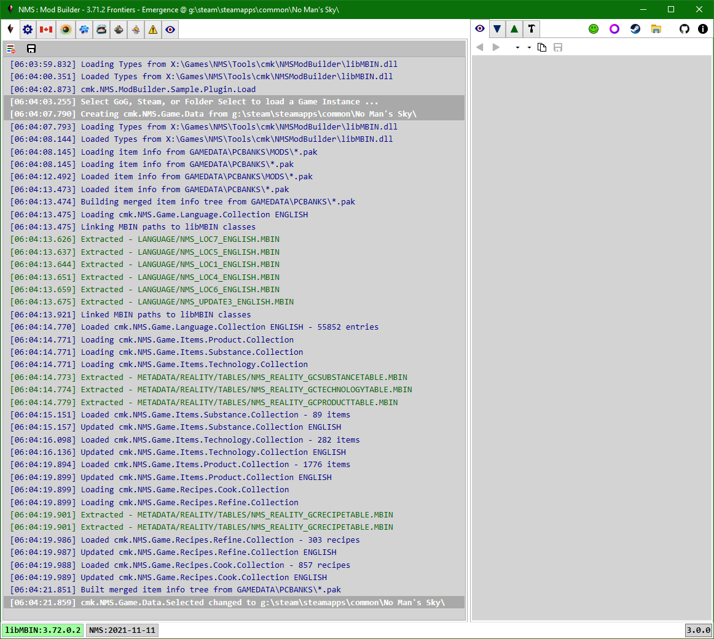

# Application

> In the future any app configuration settings would be placed here.

Currently displays the default Log.

Each log window has Clear and Save buttons in their toolbar. 
The default save file name is based on the data the log represents.

 

## Log Entries

### Loading
- **Loading Types from ... :**
  Each game instance gets it's own wrapper around the linked libMBIN.dll.
  This allows different game instances that use the same libMBIN.dll version, but may have different mbin's,
  to display the game instance specific mbins in the [libMBIN API tab](../MBINC/MBINC.md).
  So even though it already did this at the application level, it needs to do it again per game instance.
- **Loading item info from ... :**
  Load meta-data for each pak file in the PCBANKS and PCBANKS/MODS folders.
  - Load each pak header and manifest.
    Pak item Info objects are created for each manifest entry.
    The Info objects contain the item Path and meta-data required to extract the item Data.
    Each pak file wrapper maintains both a sorted list and a tree of manifest Info objects.
  - Load the header for each pak mbin item.  Mainly used to get the top-level class for each mbin, so the mbin can be linked to the corresponding MBINC class.
- **Building merged item info tree from ... :**
  The game pak files (PCBANKS) have their Info lists added to a merged Info tree.
- **Linking MBIN paths to libMBIN classes:**
  Link the Path of each game pak mbin item to the top-level class in the game instance libMBIN wrapper.
- **Loading cmk.NMS.Game.Language.Collection:**
  Each supported language has Id - value pairs stored in 5 or more mbin's.
  This loads all the mbin's for the current language, and adds all Id - value pairs to a dictionary.
  The dictionary is displayed in the [Language tab](../Language/Language.md).
  It is also used to map Game.Item Id's to localized strings.
- **Loading cmk.NMS.Game.Items.\*.Collection:**
  Load the corresponding mbin, create a wrapper for each item.
  The wrapper objects contain the Id's, localized strings, and bitmap versions of the icon.
  These collections are displayed in the [Substances, Products, Technologies tabs](../Items/Items.md).
- **Loading cmk.NMS.Game.Recipes.\*.Collection:**
  Load the recipes mbin and create wrappers for each item.
  The wrapper objects contain the Id's, localized strings, and bitmap versions of the icon.
  These collections are displayed in the [Refiner & Cooking Recipes tabs](../Recipes/Recipes.md).
- **Updated cmk.NMS.\*.Collection 'ENGLISH':**
  Whenever the current language is changed the Game.Items and Game.Recipes lists have their localized strings updated.
  It takes 1-2 seconds to load a different language.

The above tasks are done in parallel.
This means that having a processor that supports more concurrent threads will help keep the load time down.
It also means the load may become I/O limited, especially if the game files are on a hard-disk instead of an SSD.

### Errors
- As mentioned the Application tab log window is the tied to the default Log object.
  Whenever there is a message to be logged but the class|method wasn't explicitly provided a Log object the default Log object is used.
  As such, if something doesn't seem to be working in another tab it may be worth coming back to the Application tab to see if an error was logged.

 
