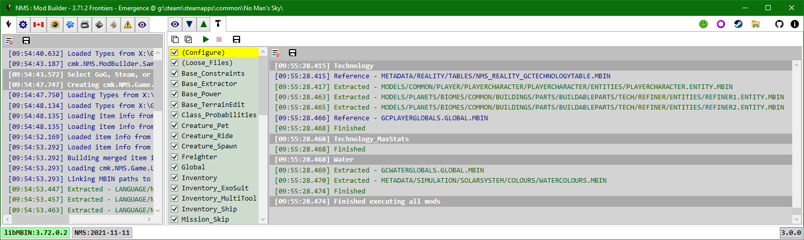
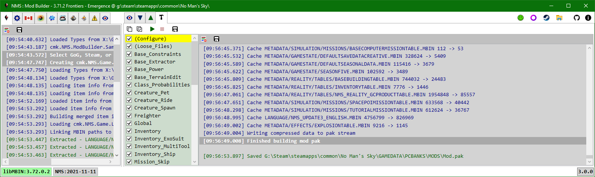

# Build
After sucessfully creating a mod Assembly from the [Mod Scripts](../ScriptMod/ScriptMod.md) tab, you can use the Build tab to:
- Call the Execute method on all mod script instances that have CanExecute == true.
  Mods are executed in the order they are displayed in the Mod Scripts tab (alphabetical).
- Build an in-memory mod pak file.
- Save the in-memory mod pak file to disk.
  By default it will prompt to save Mod.pak in the game MODS folder.
  The user is responsible for ensuring there is no DISABLEMODS.txt file in the PCBANKS folder.

After executing all enabled mods, the last log message will be "Finished executing all mods":

When you execute the selected scripts the log viewer will provide feedback.
If a mod Execute didn't throw any uncaught exceptions then you will see "Finished." as the last log item for a given mod Execute.

After building the in-memory mod pak stream, the last log message will be "Finished building mod pak":

If an in-memory mod pak stream is created a Save File dialog is displayed to save the stream to a file.
By default it will prompt to save Mod.pak in the game PCBANKS/MODS/ folder; however, you can save it to another location.

In general you will see 3 types of log items when executing a given mod:
- **Extracted**  The mod extracted | created | cloned a new Data instance.
  The extracted data is added to the DataCache.
- **Reference**  The script was able to get the requested path from the DataCache.
  This allows all mods to apply their edits to the same Data instance.
  i.e. mods can overwrite changes made by earlier scripts if they edit the same fields.
- **Warning | Error**  Something bad happened, hopefully the message provides enough information to fix.
  Warnings and errors should be rare, as all field name errors are caught when the mod Assembly is compiled.
  This generally happens when libMBIN can't decompile a mbin i.e. libMBIN hasn't been updated to handle recent game updates.
  > There are two steps when libMBIN extracts a mbin for viewing:
  > i) Decompile from binary mbin to .NET object.
  > ii) Convert from .NET object to exml | ebin.  
  > 
  > Since the mods are only doing i) you will only see those errors.
  > For example, a new game release breaks a class in a way that isn't detected by i) but is by ii),
  > you will not get an error on Build, but there may be a GUID mismatch error in the Application tab log.
  > Regardless, you should always view the built mod diffs to verify that the mod data is valid.

The log will also list any loose files added by each mod.  Loose files are only added if the mod Execute runs without throwing an uncaught exception.

The Save (build) action will add compression information to the log.
It will list each item that is added to the mod pak:
- Cache | Loose will indicate which cache the item came from.
- The path is displayed as it will be stored in the pak file manifest.
- \# -> \# displays the uncompressed and compressed sizes of the item data.

If the mod pak is saved to the game MODS folder then the PAK Items tab combobox will detect the change and be updated.
If the mod pak you save overwrites an existing mod pak then that mod pak file will reload its item info list | tree.
If you were viewing an item from the mod pak that is overwritten it will be reloaded from the new mod pak file.

 
