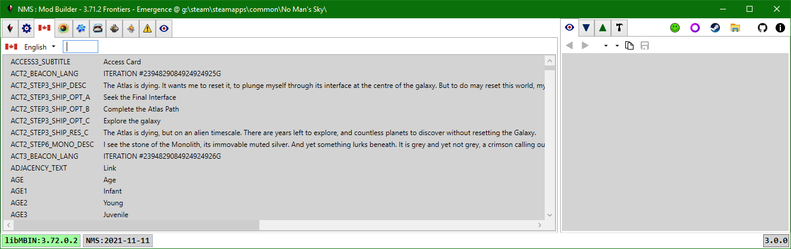
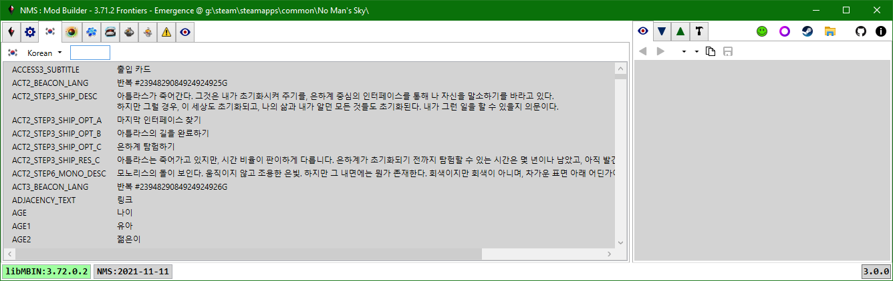

# Language

Selecting a language from the toolbar combobox will load all the corresponding language mbin items from the game pak files.
The language Id - localized string value dictionary is used to lookup display names for the substances, products, technologies, and recipe lists in the other tabs.

The search filter uses simple case-insensitive substring searches.

---
