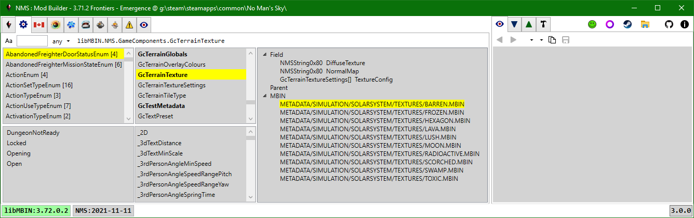
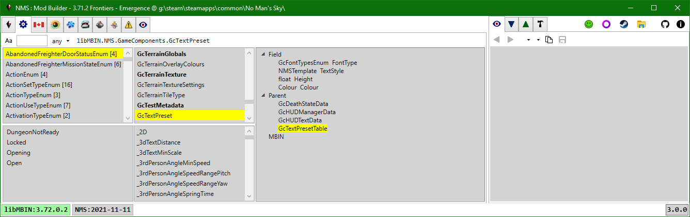

# libMBIN API

First column: All enums on top, enum values for selected enum on bottom. 
Second column: All classes on top, all fields on bottom. 
Third column: Fields for selected class, parent classes that have 1+ fields that use the selected class, mbin's with the selected class as the top-level object. 

Class names are bold if the class is a top-level class for 1+ mbin.
This only applies when there is a selected game instance, 
as the class - mbin links are determined when a game instance is loaded.
It's possible that different game instances will use the same libMBIN version, but have different mbins.
To handle this each game instance gets it's own libMBIN wrapper copy whose classes are linked to the game instance mbins.

Selection:
- Selecting an enum will populate the enum value list, clear any selected field, and select the class that defines the enum.
- Selecting a field will select the class that defines the field.
- Selecting a class will clear any selected field.
- In all cases the selected class tree will be updated.

Double-clicking in the selected class tree:
- Field: If the field uses a libMBIN class then select that class.
- Parent: Select the class.
- MBIN: View the selected item in the PAK Items tab.

Classes and MBIN's:
- 0 Parent, 0 MBIN:
  The class exists in a heirarchy that is only referenced by NMSTemplate fields.
- 0 Parent, 1+ MBIN:
  The class is not explicitly used by any class field.
  The class is the top-level class for the MBIN's.
- 1+ Parent, 0 MBIN:
  Each Parent has 1+ fields that use the selected class.
  The class is not a top-level class for any mbin's.
- 1+ Parent, 1+ MBIN:
  Each Parent has 1+ fields that use the selected class.
  The class is the top-level class for the MBIN's.

In all cases the Parent's only represent cases where the class is explicitly used as a field.
It's possible a class is also used by a NMSTemplate, NMSTemplate[], and|or List\<NMSTemplate\> field.
To detect cases where a class is only used via NMSTemplate field, a deeper inspection of each mbin would be required;
use a Query Script to find these mbin's.

The lists can be filtered using the toolbar textbox.  The search text can use Regex or *, ? wildcards. 
Enums can be further filtered based on number of values they have.

 
