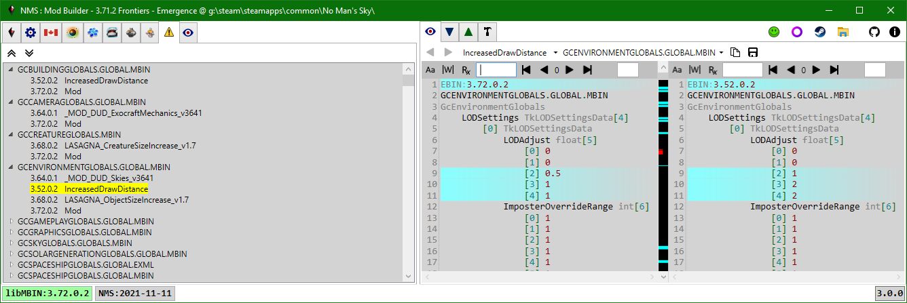

# PAK Conflicts

Conflicts occur when two or more mod pak files contain the same game pak item. 
The conflicts tab is only displayed if conflicts are found.

In the above screenshot we can see that 4 mod pak files contain GCENVIRONMENTGLOBALS.GLOBAL.MBIN;
the game will only load one, the changes in the other mod pak files will be ignored.

The mods are prefixed with the MBINC version used to compile the mod mbin in conflict.
Double-clicking on the mod name will open a diff view of the game version of the mbin (left) and the clicked mod version of the mbin (right).

 
