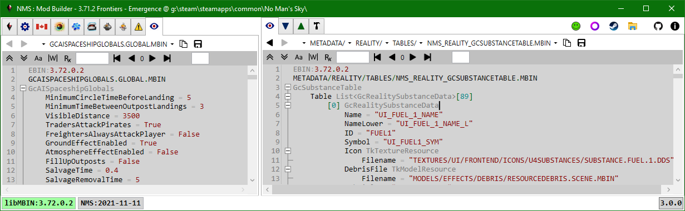

# PAK Items

In split-tabs mode there are two PAK Items tabs, the last tab in the left set of tabs and the first tab in the right set of tabs.
Both have the same functionality.
To view a pak item first select the pak tree you wish to browse, by selecting an item from the pak combobox. 
The first entry (blank, default) represents the merged game pak item tree (all pak items from all game pak files), it is followed by the individual mod paks.

> The app used to display all the game pak files in the combobox as well,
> but without a use-case for selecting a specific game pak file that code has been disabled.

Once a pak item tree is specified you can use the breadcrumb control to pick a pak item. 
Once several pak items have been viewed you can use the Previous | Next buttons on the toolbar to move through recently viewed items. 
You can use the Copy button to copy the path string to the clipboard e.g. to paste into a script. 
You can use the Save button to save the current item to disk.  You can save items even if they don't have a viewer.
Some items can be saved in in multiple formats.

 
 

## Formats

### .MBIN & .MBIN.PC

Mbin items are viewed using a custom text file format (ebin).
Mbin items can be saved to disk as mbin binary, exml text, or ebin text files.

The first line specifies the libMBIN version that was used to decompile the mbin.
For game mbin's this is the version associated with the game instance release.
For mod mbin's this is the version used to compile the mbin. 
The second line is the pak item path. 
The third line is the top-level libMBIN class name.  This is the object that gets created when libMBIN deserializes the mbin binary data.

#### Mod Diff View
Side-by-side, or diff, viewers are automatically used if the selected item is from a mod and there is a corresponding item in the game pak files.

#### Color Swatch
Ebin uses (...) to wrap colours, [...] to wrap vectors, and |...| to wrap quaternions. 
A custom background renderer draws swatches for color values (ignores alpha).

#### Language ID
Double-click a language Id to put it in the toolbar along with the localized string (if found).
Double-click a substance, product, or technology Id to put the language Id for the lower-case name in the toolbar along with the localized string (if found).
You can also type a language Id string in the language Id textbox, but it is usually easier to use the Language tab.

#### Path
Double-click a pak item path to view the item.
The application will try to fix-up path errors e.g. strip leading slash, convert \ to /, make all upper-case, converts .PNG to .DDS, .EXML to .MBIN, ... .
 
 

 

### .SPV
Spv items are compiled Vulkan GLSL shaders.
The application uses spirv-cross.exe to decompile these to text for display.
Spv items can be saved to disk as spv binary, or decompiled glsl text files.

 

### .DDS
All images are stored in dds format.
The dds viewer displays format information, and allows the user to select a background (checker, solid black, solid white), and scaling options (fit, tile, center).

 
