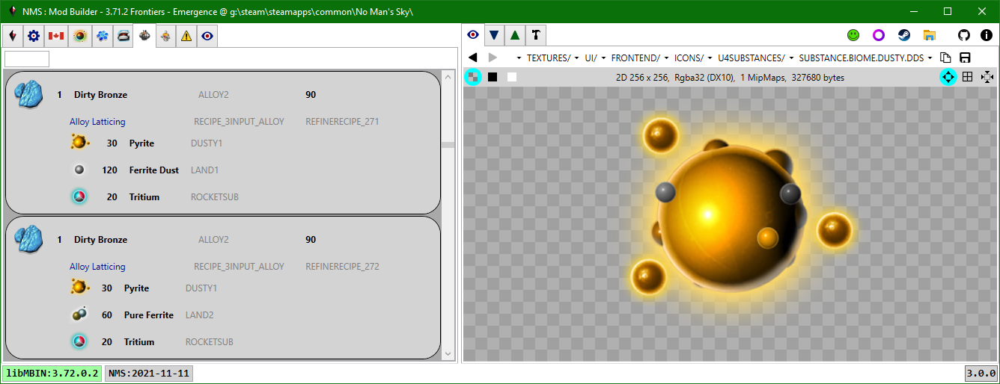
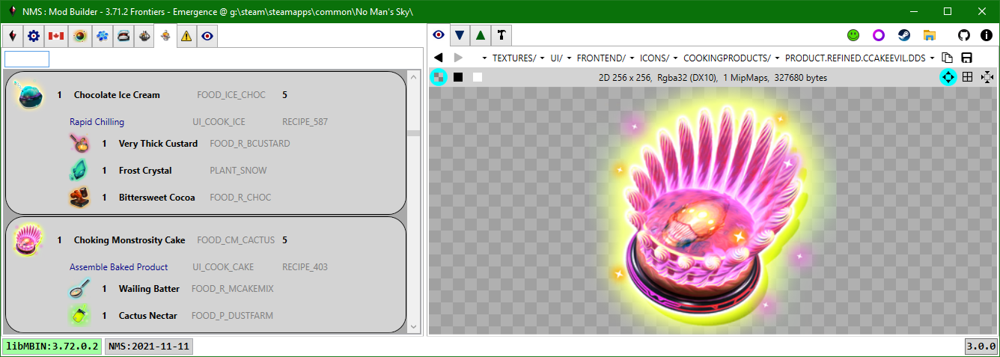

# Refiner & Cooking Recipes

Recipes are sorted by: result, result amout, time to make, recipe id.
Double-clicking the icon will open the corresponding dds item in the PAK Items tab.

The lists are drawn using virtualization - only the ui elements to be displayed are generated.
If you scroll through a list with many items you will get periodic lag, this is a result of the .NET WPF control not the application code;
the WPF control is having to repeatedly regenerate the ui elements to display as you scroll.
It is possible to disable the list virtualization; however, it can then take 5+ seconds to generate all the ui elements for the list the first time the tab is selected,
as well as when the filter is changed.

The search filter uses simple case-insensitive substring searches.

 
