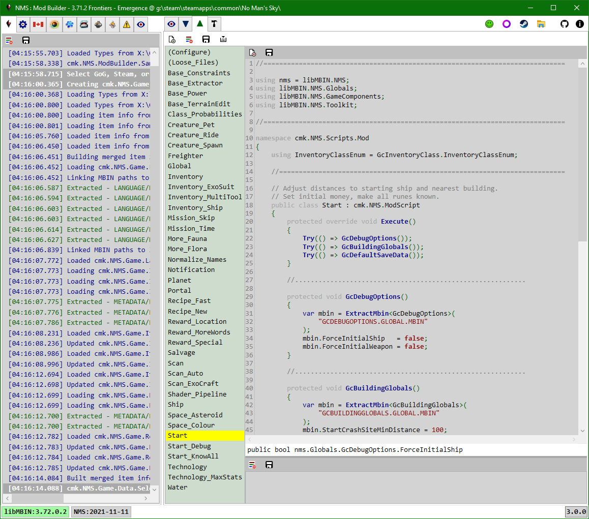

# Mod Scripts

Use C# to create a mod for the currently loaded game instance.

The tab toolbar has buttons to: create a new script, clear all script logs, save all script edits to disk, compile all scripts and build an in-memory Assembly (dll). 
The script toolbar has buttons to: delete, save.

---

## New
The New Script button will create a new .cs script file in the ./Scripts/Mod/ folder.
A file system watcher will detect the new file and add it to the listbox.

When creating a new script a popup will prompt for the script file name. 
Double-clicking a script file name will open a popup to rename the script file.

The class name is initially set to the file name with ' ', '_', and '-' removed.

When you create | rename | delete a mod script the application will automatically create | rename | delete a subfolder with the same name as the script.
e.g. ./Scripts/Mod/MyScript.cs will have a corresponding ./Scripts/Mod/MyScript/ folder.
The subfolder is where you can put script specific loose files e.g. textures, audio, other files that are needed, but aren't generated, by the script.
A *dummy* (Loose_Files) script is provided as somewhere to place loose files that should be added to the mod pak, but not tied to a script being enabled or not.

The path used for the loose files, when added to the mod pak, is relative to their script subfolder
e.g. ./Scripts/Mod/MyScript/Dir1/Dir2/Item.ext would be added to the mod pak as DIR1/DIR2/ITEM.EXT.

> Before deleting a script make sure you copy any loose files you want to keep out of its folder.

---

## Edit

> ./Scripts/Mod/ModScripts.sln can be used to edit the mod scripts (.cs) in Visual Studio.  Do not compile in Visual Studio. 
> Do not have the app open when editing the mod .cs in Visual Studio.  Visual Studio does create new - rename script to tmp - rename new to script - delete tmp, so there is no continuity between the old script version and its edited version.  If the app is open when you save a .cs in VS it will corrupt the associated folder.  Likewise, if you delete a .cs in VS you will have to manually delete any associated folder.  To edit using another IDE just reference cmkNMSCommon.dll, cmkNMSModBuilder.dll, and libMBIN.dll.

Each mod script file must have 0 or 1 class that derives from cmk.NMS.ModScript (and overrides its Execute method).
New scripts are created from a template that meets these requirements.

The script file may also contain other classes and methods.
Unlike query scripts, which must have a cmk.NMS.QueryScript based class, mod script files can contain almost any code, since all mod script files are compiled into a single Assembly.
This means you can add scripts that just contain helper classes and methods to be used by other scripts.

However, mod script files should have no more than 1 cmk.NMS.ModScript based class per script file.
This is because each script will add the loose files from it's script file subfolder when it runs.
A mod script file with multiple cmk.NMS.ModScript classes will result in the loose files being added multiple times,
which will work but likely result in warnings.

All types and methods used by a mod script must be in a loaded Assembly or another mod script file, the Assemblies are generally from: .NET library, a .NET exe | dll in the application folder, or a .NET dll in the ./Plugins folder.

As you move the cursor over the script intellisense like feedback is provided in the script window statusbar.
When you enter a '.' the app will display any available code-completion options in a popup e.g. methods, fields.

> You can double-click a pak item path string to view the item in the PAK Items tab.

There are three main properties a script will use:

- **Game**  This is the currently loaded game instance.  It contains the following notable properties:
  - **Location**  Game path, NMS build date, Release information.
  - **MBINC**  libMBIN | MBINCompiler to be used based on Release information.
    Currently this will always be the link loaded libMBIN.dll.
  - **PCBANKS**  Collection of all game pak files.
  - **MODS**  Collection of all mod pak files.
  - **Language**  Dictionary of language Id - Value pairs for current language Identifier.
  - **Substances, Products, Technologies**  Lists of the various in-game items.
  - **RefinerRecipes, CookingRecipes**  Lists of the various in-game recipes.
- **Log**  List of log items for script.  These items are displayed in the Log view, below the script editor.
- **Cancel**  A token that is signalled when you click the Cancel button in the Build toolbar while the scripts are being Executed.

Most mods tend to follow the same pattern:
- Extract a mbin from the current game instance pak files, and have libMBIN deserialize it into a .NET in-memory object.
- Modify mbin object field(s).

To extract a mbin you can use the following: 
**var mbin = ExtractMbin\<CLASS\>( string PATH, bool NORMALIZE = true, bool LOG = true );** 
Where:
- mbin is the variable name of the deserialized object to modify.  It can called whatever you want, but most bundled scripts just use mbin.
- ExtractMbin\<class\>(...) is a method that:
  - If NORMALIZE is true then normalize the specified PATH e.g. adjust slashes, make upper-case, adjust extensions, ... .
  - Check if PATH is cached (previously extracted), return reference to cached object if present.
  - Call Game.PCBANKS.ExtractMbin<...>(...)
    - Calls Game.PCBANKS.FindInfo() to get the NMS.PAK.Item.Info object for the PATH.
    - Uses the Info to extract the raw binary data from the pak file.
    - Decompress the raw pak binary data into raw mbin data.
    - Wrap the raw mbin data in a NMS.PAK.MBIN.Data object.
    - Use libMBIN to decompile the raw mbin data into it's top-level mbin object.
  - Check that the extracted mbin object is of type CLASS.
  - Return the mbin object cast to CLASS. 

> When viewing mbin's (e.g in PAK Items tab) the third line in the ebin is the libMBIN type you want to use as the template parameter for the ExtractMbin<> method.
> If needed, you can get the namespace by searching for the libMBIN type in the libMBIN API tab, however, in most cases the following is true:
> - If it's a "*.GLOBAL.MBIN" it will be in the libMBIN.Global namespace.
> - Else, if it's a "GC*.MBIN" it will be in the libMBIN.GameCompnents namespace.
> - Else, if it's a "TK*.MBIN" it will be in the libMBIN.Toolkit namespace.
> - Else, if it's a "SN*.MBIN" it will be in the libMBIN.SceneNode namespace (currently unused).

Other useful properties and methods:
- **Dictionary<string, NMS.PAK.Item.Data> DataCache** 
  The Key is the pak Item path, the Value is the extracted data. 
  As Data is extracted | created | cloned by the script methods, it is stored in the DataCache (one instance use by all mods). 
  The Build tab passes the DataCache to the mod pak builder. 
  Not intended to accessed directly by scripts.
- **Dictionary<string, string> LooseCache** 
  The Key is the pak Item path, the Value is file system path. 
  As mods are executed any files in their script subfolder are added to LooseCache (one instance use by all mods). 
  The Build tab passes the LooseCache to the mod pak builder. 
  Not intended to accessed directly by scripts.
- **bool CanExecute** 
  Only scripts with CanExecute == true will be executed in the Build tab.
- **AS_T Mod<AS_T>()** 
  Try to find the instance of another mod with class Type name AS_T. 
  e.g. var mod = Mod<Base_Constraints>(); 
  Mainly used to set CanExecute = true | false for scripts that will execute after the calling script.
- **void Try( Action ACTION )** 
  Wrap ACTION in a try-catch block that adds any exception to the Log. 
  Use where you still want a script to continue, even if ACTION fails.
- Get NMS.PAK.Item.Data based wrappers around decompressed pak item data.
  - **AS_T ExtractData<AS_T>( string PATH, bool NORMALIZE = true, bool LOG = true )**
  - **AS_T CreateData<AS_T>( string PATH, bool NORMALIZE = true, bool LOG = true )**
  - **AS_T CloneData<AS_T>( string EXISTING_PATH, string CLONE_PATH, bool NORMALIZE = true, bool LOG = true )**
- Get libMBIN.NMSTemplate based objects from (cached) NMS.PAK.MBIN.Data objects.
  - **AS_T ExtractMbin<AS_T>( string PATH, bool NORMALIZE = true, bool LOG = true )**
  - **AS_T CreateMbin<AS_T>( string PATH, bool NORMALIZE = true, bool LOG = true )**
  - **AS_T CloneMbin<AS_T>( string EXISTING_PATH, string CLONE_PATH, bool NORMALIZE = true, bool LOG = true )**
- Clone a libMBIN.NMSTemplate based object. 
  - **NMSTEMPLATE_T CloneMbin<NMSTEMPLATE_T>( NMSTEMPLATE_T NMSTEMPLATE )** 

When cloning a Data item:
- EXISTING_PATH is either a DataCache Key (previously extracted | created | cloned) or a Game.PCBANKS Item path.
- CLONE_PATH is the path to be stored in the mod pak file. 
  Will replace any existing Data with same path in DataCache.

---

## Compile
Once all scripts are complete you must build an in-memory mod Assembly that contains the compiled code for all the mod scripts.
Due to how the scripts are currently associated with the mod Assembly project, all scripts must compile without errors in order to build the mod Assembly, even if they won't be executed.

Once the mod Assembly is built, the code will create a single instance of each cmk.NMS.ModScript based class in the mod Assembly.
The Build tab will iterate through these objects and call Execute on each if it's CanExecute == true.
Mod instance CanExecute values can be set using the checkboxes in the Build tab before executing, or by a script that calls Mod<...>.CanExecute = ... while executing.

Once the mod assembly is built goto the [Build](../Build/Build.md) tab.

---
