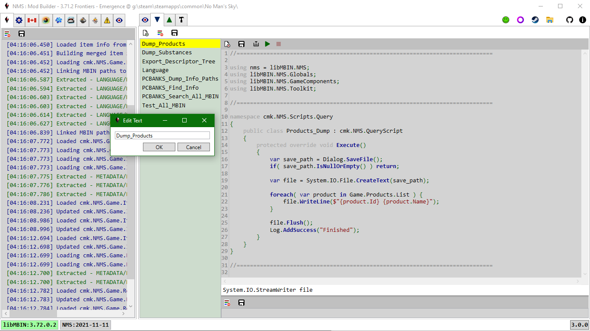
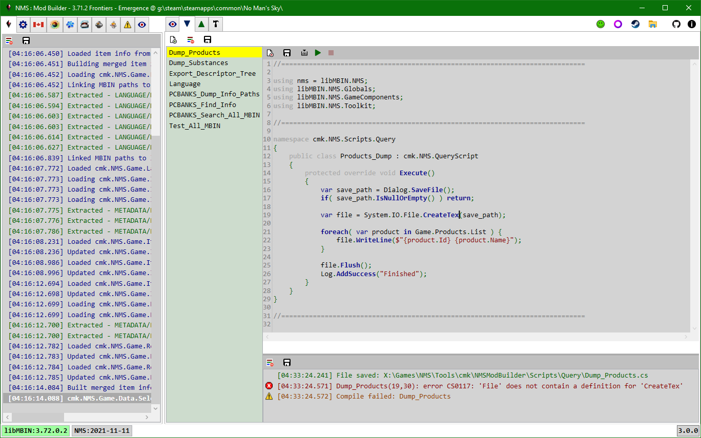

# Utility Scripts

Use C# to query the currently loaded game instance, in particular from its pak files mbin items.

The tab toolbar has buttons to: create a new script, clear all script logs, save all script edits to disk. 
The script toolbar has buttons to: delete, save, compile, execute, stop execute (only enabled while script running).

---

## New
The New Script button will create a new .cs script file in the ./Scripts/Query/ folder.
A file system watcher will detect the new file and add it to the listbox.

When creating a new script a popup will prompt for the script file name. 
Double-clicking a script file name will open a popup to rename the script file.

The class name is initially set to the file name with ' ', '_', and '-' removed.

---

## Edit
Each query script file must have a class that derives from cmk.NMS.QueryScript and overrides its Execute method.
New scripts are created from a template that meets these requirements. 
The script file may also contain other classes and methods.
All types and methods used by a query script must be in a loaded Assembly, these are generally from: .NET library, a .NET exe | dll in the application folder, or a .NET dll in the ./Plugins folder.

As you move the cursor over the script intellisense like feedback is provided in the script window statusbar.
When you enter a '.' the app will display any available code-completion options in a popup e.g. methods, fields.

> You can double-click a pak item path string to view the item in the PAK Items tab.

There are three main properties a script will use:

- [Game](../../../Common/NMS/Game/Game.Data.cs).  This is the currently loaded game instance.  It contains the following notable properties:
  - Location.  Game path, NMS build date, Release information.
  - MBINC.  libMBIN | MBINCompiler to be used based on Release information.
    Currently this will always be the link loaded libMBIN.dll.
  - PCBANKS.  Collection of all game pak files.
  - MODS.  Collection of all mod pak files.
  - Language.  Dictionary of language Id - Value pairs for current language Identifier.
  - Substances, Products, Technologies.  Lists of the various in-game items.
  - RefinerRecipes, CookingRecipes.  Lists of the various in-game recipes.
- [Log](../../../Common/Utility/Log.cs).  List of log items for script.  These items are displayed in the Log view, below the script editor.
- Cancel.  A token that is signalled when you click the Cancel button in the script toolbar while the script is being Executed.

---

## Compile

The results of the compile, including any errors, will be displayed in the Log view below the script editor. 
In the above example we deleted the last 't' from the CreateText method name.
The error tells us the script file name (Dump_Products), the line (19), column (30), and what is wrong (System.IO.File class does not contain a 'CreateTex' method).

---
