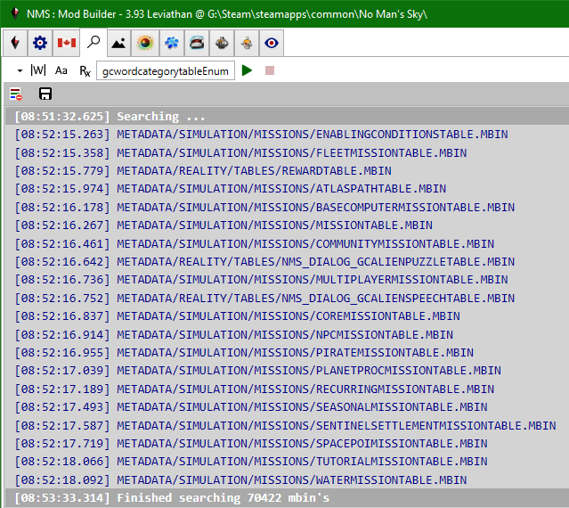
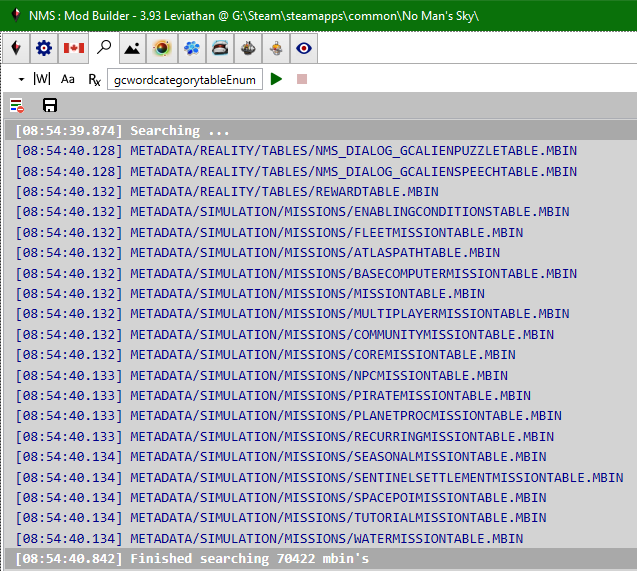

# Search MBIN text (EBIN)
Search mbin's for a given search expression, language mbin's are excluded. 
Mbin's are extracted from their pak file, decompiled into a .NET object using libMBIN.dll, then converted to an ebin text string.  The ebin text is searched using a regex expression built based on the button states and the text box text.

First or uncached search: 

Search after cache primed: 

Use the combobox to select the source.  The first entry (blank, default) represents the merged game pak item tree (all pak items from all game pak files), it is followed by the individual mod paks.

Specify the search pattern (*, ? wildcards or regex expression, along w/ toolbar options for whole word and case-sensitivity). 
Click Search button to start search, Cancel button to abort search. 
If you cancel a search it will show the count of mbin's searched to that point.

It takes ~2 min to search all 70K mbin's w/o caching, and about 1 sec w/ caching (after first search).  Caching is enabled by default but requires ~36GB of memory to hold all cached mbin data.  If your system has less than ~44 GB of physical memory you should specify the no_mbin_cache command-line option, in which case each search will take ~2 min.

 
