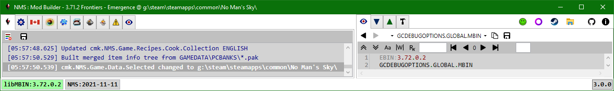
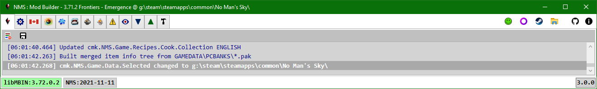

# Tabs

## Split Tabs

By default the application starts in split-tab mode. 
In this mode there are two groups of tabs, roughly divided into research tabs and script|mod tabs. 
Where an action would open a pak item in the PAK Item tab viewer e.g. double-clicking pak item path string,
the item will generally be opened in the PAK Item tab viewer in the 'other' set of tabs. 
For example, double-clicking a MBIN path in libMBIN API tab (left set of tabs) will open the mbin in the PAK Item tab viewer in the right set of tabs.
Likewise, double-clicking a pak item path in a script (right set of tabs) will open the pak item in the PAK Item tab viewer in the left set of tabs.

 
 

## Single Set of Tabs

You can use the **no_split_tabs** command-line option to use the old single set of tabs. 
> This option will likely be removed in future releases.

 
 

## Possible Tabs

* [Application](Application/Application.md)
* [libMBIN API](MBINC/MBINC.md)
* [Language](Language/Language.md)
* [DDS](Dds/Dds.md)
* [Substances, Products, Technologies](Items/Items.md)
* [Refiner & Cooking Recipes](Recipes/Recipes.md)
* [PAK Conflicts](PakConflicts/PakConflicts.md)
* [PAK Items](PakItems/PakItems.md)
* [Query Scripts](ScriptQuery/ScriptQuery.md)
* [Mod Scripts](ScriptMod/ScriptMod.md)
* [Build](Build/Build.md)
