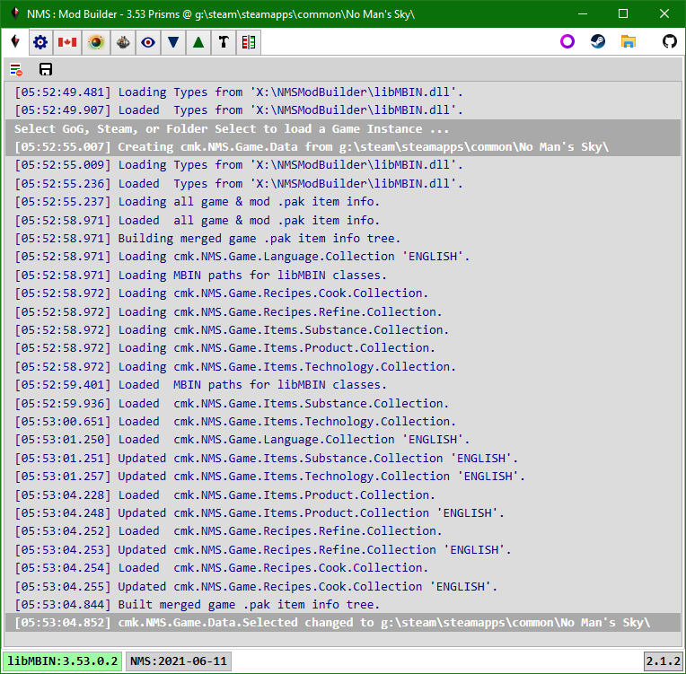

# Application

Currently displays the default log.

Each log window has Clear and Save buttons in their toolbar. 
The default save file name is based on the data the log represents.

> In the future any app configuration settings would be placed here.

 
