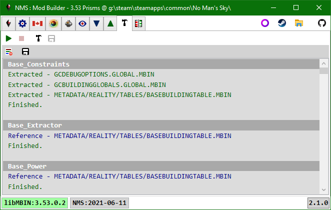

# Mod Builder

After sucessfully creating a mod assembly on the [Mod Scripts](Tab_ModScripts.md) tab, you can use the Mod Builder tab to:
- Execute all enabled scripts.
  The app will create instances of the enabled script classes and call their execute methods.
  Scripts are executed in the order they are displayed in the Mod Scripts tab (alphabetical).
- Build an in-memory mod pak file.
- Save the in-memory mod pak file to disk.
  By default it will prompt to save Mod.pak in the game MODS folder.
  The user is responsible for ensuring there is no DISABLEMODS.txt file in the PCBANKS folder.

When you execute the selected scripts the log viewer will provide feedback.
If a mod Execute didn't throw any exceptions then you will see "Finished." as the last log item for a given script.

In general you will only see 3 types of log items for a given script:
- Extracted.  The script extracted a new instance of pak item data.  The extracted data is cached.
- Reference.  The script was able to get the pak item data from the cache.
  This allows all scripts to apply their edits to the same pak item data instance.
  i.e. scripts executed later can overwrite changes made by earlier scripts if they edit the same fields.
  Reference log entries would be listed as (potential) conflicts in AMUMSS.
- Warning|Error.  Something bad happened, hopefully the message and stack dump provide enough information to fix.
  Warnings and errors should be rare, as all field name errors are caught when the mod assembly is compiled.

After Executing all enabled mods you can use the [Mod Diffs](Tab_ModDiffs.md) tab to view the diffs for the edited pak items.
You may want to do this before building the mod pak to verify all expected changes were made
e.g. if you are creating a mod with many large loose files (like textures), it could take a while to build the pak.

If the mod pak is saved to the game MODS folder then the PAK Items tab combobox will detect the change and be updated.
If the mod pak you save overwrites an existing mod pak then that mod pak file will reload its item info list|tree.
If you were viewing an item from the mod pak that is overwritten it will be reloaded from the new mod pak file.

 
