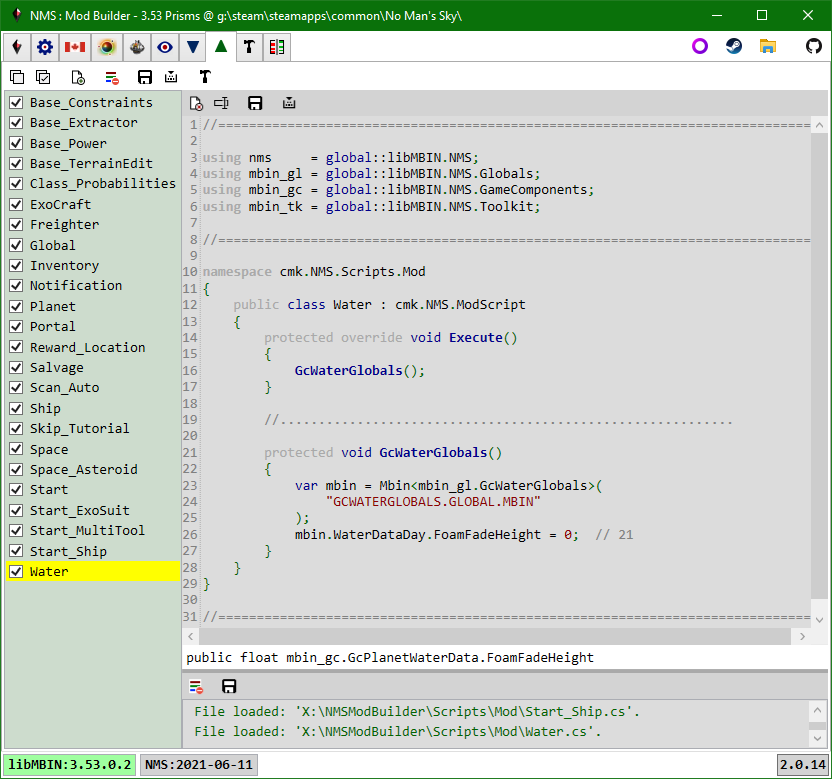

# Mod Scripts

Use C# to modify data for the currently loaded game instance, in particular its mbin's.

The tab toolbar has buttons to: enable|disable all scripts, create a new script, clear all script logs, save all script edits to disk, build mod assembly (in-memory). 
The script toolbar has buttons to: delete, rename, save, compile.

## New Script

The New Script button will create a new script file in the app/Scripts/Mod/ folder.
A file system watcher will detect the new file and add it to the listbox.
The class and file names are initially set to the current tick count.

A class cannot start with a number, so you must rename the class, and should rename the file.

Every query script must be derived from cmk.NMS.ModScript.
New scripts are created from a template that already does this.

Every mod script has an Execute method.
This is the method that is called when the Execute button is clicked in the Mod Builder tab.

When you create|rename|delete a script the app will automatically create|rename|delete a subfolder with the same name as the script.
e.g. app/Scripts/Mod/MyScript.cs will have a corresponding app/Scripts/Mod/MyScript/ folder.
The subfolder is where you can put script specific loose files e.g. textures, audio, other files that are needed, but aren't generated, by the script.
A 'dummy' Loose_files script is provided as somewhere to place loose files that should be added to the mod pak, but not tied to a script being enabled or not.

> Before deleting a script make sure you copy any loose files you want to keep out of its folder.

## Editing

See: [Query Scripts](Tab_QueryScripts.md#Editing)

Most mods tend to follow the same pattern:
- Get the mbin data for a specific pak mbin item.
- Modify field(s) in the mbin data object.

> Remember, you can double-click a pak item path string to view the item in the PAK Items tab.

> Remember, when viewing mbin's (e.g in PAK Items tab) the third line is the libMBIN type you want to use as the template parameter for the Mbin<> method.
> You can get the namespace by searching for the libMBIN type in the libMBIN API tab, however, in most cases the following is true:
> - If it's a "*.GLOBAL.MBIN" it will be in the mbin_gl namespace.
> - Else, if it's a "GC*.MBIN" it will be in the mbin_gc namespace.
> - Else, if it's a "TK*.MBIN" it will be in the mbin_tk namespace.

> Remember, when editing the script a code-completion popup will list all fields and methods for the mbin variable when you enter '.' after the mbin variable name.

It's up to the user how they want to manage scripts, two typical approaches are:
  1.  Group related changes in a single script.  The provided scripts follow this approach.
  2.  Group all changes to a single pak item in a single script
      e.g. you might have a GcDebugOptions script that has all changes to GCDEBUGOPTIONS.GLOBAL.MBIN.

Approach 1 has the advantage of being able to see and change multiple aspects of a mod concept in one script.
Approach 2 has the advantage of being able to quickly disable all changes to a specific pak item
e.g. a new game Release breaks libMBIN for the given pak mbin.

## Mod Assembly

Once all scripts are complete you must build a mod assembly.
This is an in-memory dll that contains all the code defined in all the scripts.

Due to how the scripts are currently associated with the mod assembly project, all scripts must compile without errors in order to build the mod assembly, even if the are disabled.
However, only enabled mods will be executed and have their loose files included in the built mod pak.

Once the mod assembly is built goto the [Mod Builder](Tab_ModBuilder.md) tab.

 
