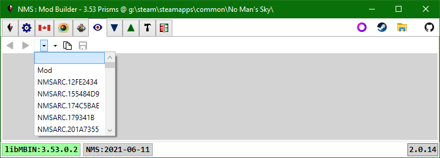
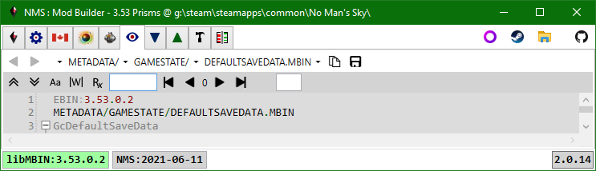
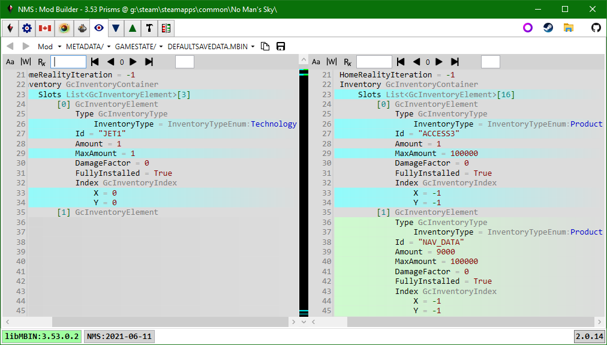
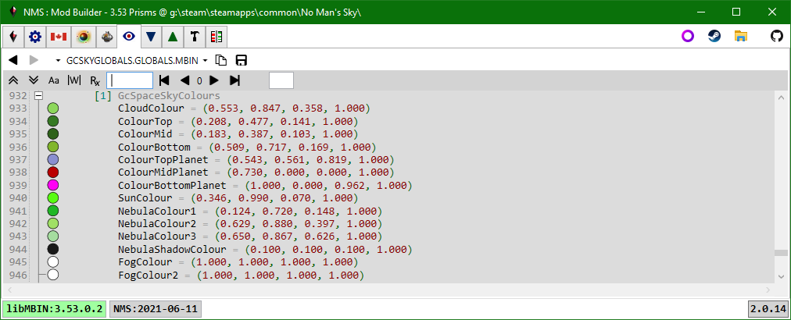
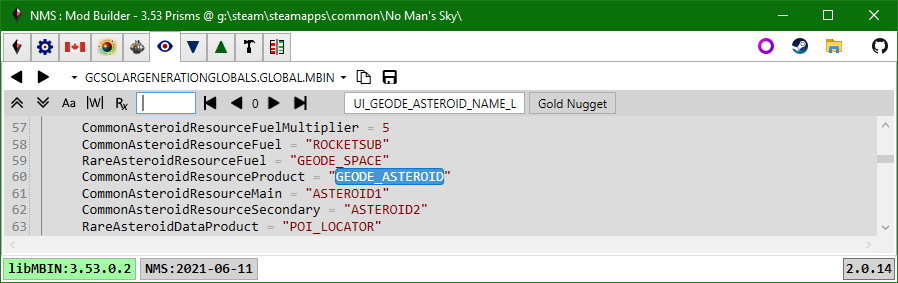
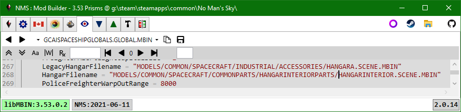
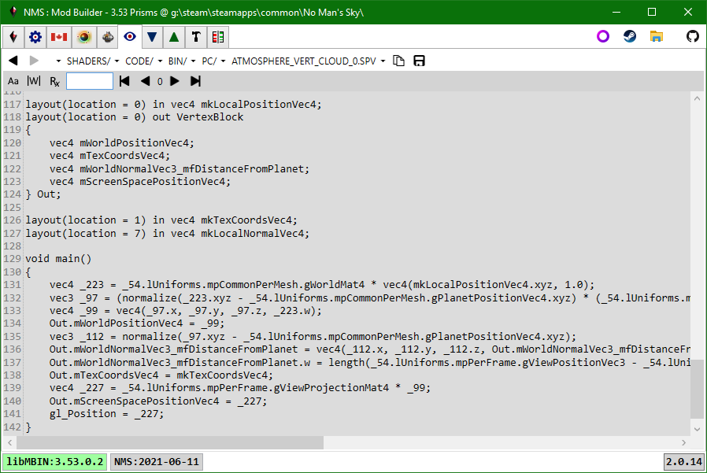
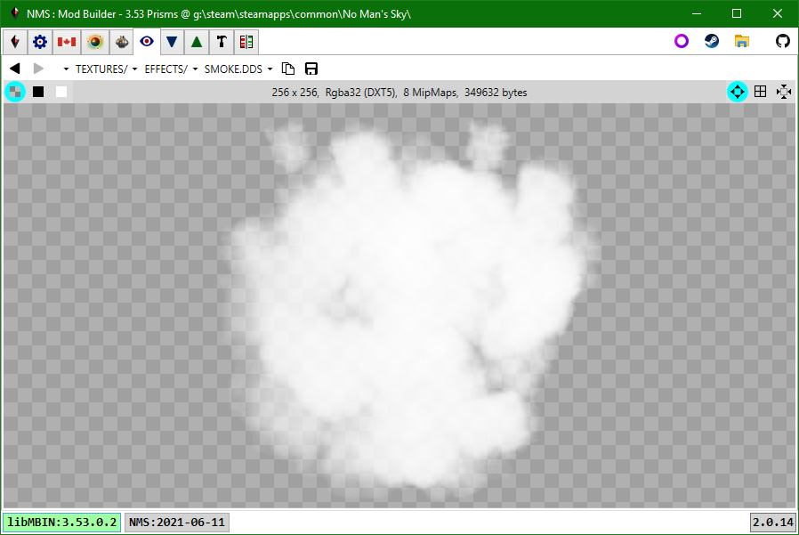

# PAK Items
First select the pak tree you wish to browse, by selecting an item from the pak combobox.
The pak combobox list: merged game paks (default - first blank item), individual mod paks, individual game paks.
Usually you will either select a mod pak (if you want to look at the changes it makes), or the merged game paks.

Once a pak item tree is specified you can use the breadcrumb control to pick a pak item. 
Once several pak items have been viewed you can use the Previous | Next buttons on the toolbar to move through recently viewed items. 
You can use the Copy button to copy the path string to the clipboard e.g. to paste into a script. 
You can use the Save button to save the current item to disk.  You can save items even if they don't have a viewer.

In this case we've loaded a pak item (.mbin) from the merged game pak tree:

In this case we've loaded a pak item (.mbin) from the Mod.pak tree:

## Notable formats
### .MBIN & .MBIN.PC
Mbin items are viewed using a custom text file format (.ebin), but can be saved to disk as .mbin (binary), .exml (xml), or the displayed .ebin (text) format.
The first line specifies the libMBIN version that was used to decompile the .mbin.
For mod .mbin's this is the version used to compile the .mbin.
For game .mbin's this is the version associated with the game instance release.

Background renderer for colour values:

Double-click a language, substance, product, or technology Id to put the language Id in the toolbar along with the localized string (if found):

Double-click a pak item path to view the item:
 
Note: app will try to fix-up errors e.g. converts .png to .dds, .exml to .mbin, ... .

 

### .SPV
Spv items are compiled Vulkan GLSL shaders.  The application uses spirv-cross.exe to decompile these to text for display:

 

### .DDS
All images are stored in .dds format:

 
