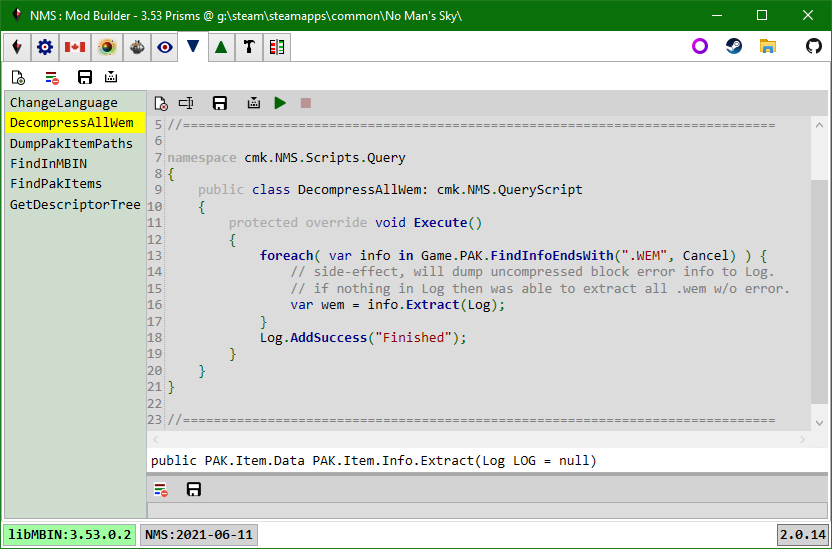

# Query Scripts

Use C# to query information from the currently loaded game instance, in particular from its pak items.

The tab toolbar has buttons to: create a new script, clear all script logs, save all script edits to disk, compile all scripts. 
The script toolbar has buttons to: delete, rename, save, compile, execute, stop execute (only enabled while script running).

## Executing

> If you add Log entries in a tight loop the UI thread may spend all its time updating the Log view.
> This may result in the other app windows and controls becoming unresponsive.
> If you may need to capture many log messages consider writing them to a file instead.

When a query script is executing you can select and execute other query scripts.
When you select a query script the script toolbar button states will update based on if the script is being executed or not.

## New Script

The New Script button will create a new script file in the app/Scripts/Query/ folder.
A file system watcher will detect the new file and add it to the listbox.
The class and file names are initially set to the current tick count.

A class cannot start with a number, so you must rename the class, and should rename the file.

Every query script must be derived from cmk.NMS.QueryScript.
New scripts are created from a template that already does this.

Every query script has an Execute method.
This is the method that is called when the Execute button is clicked.

## Editing

You can add other fields, properties, methods, classes to the script file as desired.
However, a given script file should only have one class derived from cmk.NMS.QueryScript.

As you move the cursor over the script intellisense like feedback is provided in the script window statusbar (wip).
When you enter a '.' the app will display any available code-completion options in a popup e.g. methods, fields.

The script can reference all public app objects, fields, properties, methods.

> You can double-click a pak item path string to view the item in the PAK Items tab.

There are three main properties a query script will use:

- Game.  This is the currently loaded game instance.  It contains the following notable properties:
  - Location.  Game path, NMS build date, Release information.
  - MBINC.  libMBIN|MBINCompiler to be used based on Release information.
    Currently this will always be the link loaded libMBIN.dll.
  - PAK.  Collection of all game pak files.
  - MOD.  Collection of all mod pak files.
  - Language.  Dictionary of language Id - Value pairs for current language Identifier.
  - Substances, Products, Technologies.  Lists of the various in-game items.
  - RefinerRecipes, CookingRecipes.  Lists of the various in-game recipes.
- Log.  List of log items for script.  These items are displayed in the LogViewer below the script editor.
- Cancel.  A token that is signalled when you click the Cancel button in the script toolbar while the script is being Executed.

### PAK and MOD Collections

> When methods iterate or search over a collection they will usually include Log and Cancel parameters.
> You should pass the script Log and Cancel properties to these methods to get expected logging and Cancel functionality.

The PAK and MOD collections can be used to search for pak files using a number of methods:
- FindFileFromPath.  Case-sensitive search for full pak file name i.e. exact match.
- FindFileFromName.  Case-sensitive search for pak file name, no path, no extension.

The PAK and MOD collections can be used to search for pak items using a number of methods:
- FindInfo.  Find full pak item path in all pak files.
- FindInfoEndsWith.  Find all pak items in all pak files that end with specified string (text).
- FindInfoRegex.  Use a Regex pattern to search for matching pak item paths. 
  See: https://regex101.com/ to help with building valid Regex patterns.

> In general all pak item searches are case-sensitive. 
> Pak item paths are all upper-case, have no leading slash, use '/' instead of '\\'. 
> Pak info objects contain the path for a specific item and the meta-data required to extract the item data from the pak file.

You can also iterate over the meta-data info or extracted item data:
- ForEachInfo.  Iterate over all pak item info in all pak files.
- ForEachData.  Extract a new instance of each pak item as raw data.
- ForEachMbin.  Extract a new instance of each mbin item.

> When a pak file is loaded only the info objects are generated, the item data is extracted on-demand.
> As such, iterating over the info is fast, while iterating over the data is slow, as each item has to be extracted.

Finally, you can extract specific pak items:
- Data<>.  Extract the pak item with the specified path, casts to specified NMS.PAK.*.Data type e.g. NMS.PAK.SPV.Data.
- DdsBitmapSource.  Extract the pak dds item with the specified path and convert to a bitmap, can specify the height of the resulting bitmap.
- MbinTemplate.  Extract the pak mbin with the specified path as a generic libMBIN NMSTemplate object.
- Mbin.  Extract the pak mbin with the specified path, casts to specified libMBIN NMSTemplate based class.

### File System

Several static methods are available in the Dialog class:
- SelectFolder.  Open a dialog to prompt the user to select a folder.
  Returns an empty strin if the user does not select a folder.
- OpenFile. Open a dialog to prompt the user to select a file to open.
  Returns an empty strin if the user does not select a folder.
  Can specify initial path and file.
- SaveFile.  Open a dialog to prompt the user to select a save file path and name.
  Returns an empty strin if the user does not select a folder.
  Can specify initial path and file.
  Cannot specify allowable extensions, user can use any extension.

 
