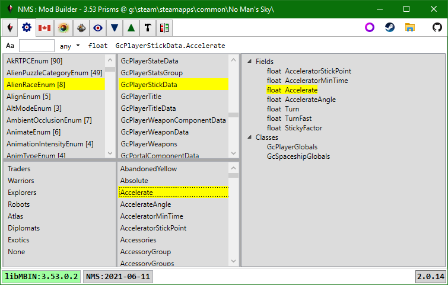

# libMBIN API

First column: all enums on top, enum values for selected enum on bottom. 
Second column: all classes on top, all fields on bottom. 
Third column: fields for selected class, and classes that have a field based on the selected class. 

- Selecting an enum will populate the enum value list, clear any selected field, and select the class that defines the enum. 
- Selecting a field will select the class that defines the field. 
- Selecting a class will clear any selected field. 
- In all cases the third column data will be updated to reflect the selected class.

The lists can be filtered using the toolbar textbox.  The search text can use Regex or *, ? wildcards. 
Enums can be further filtered based on number of values they have.

 
