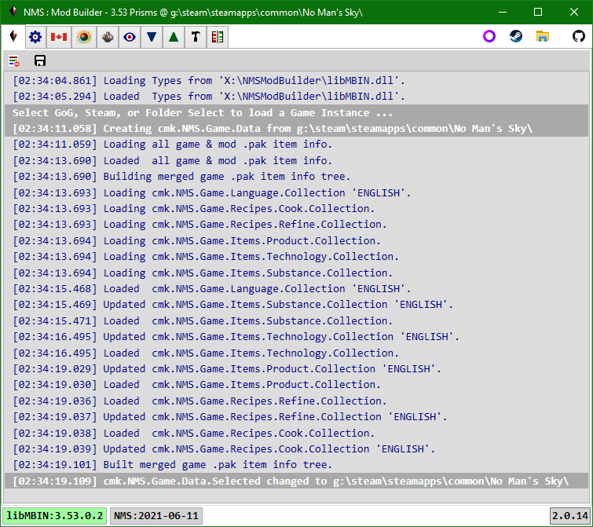
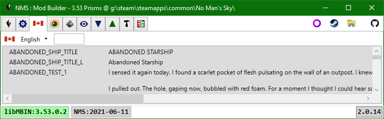
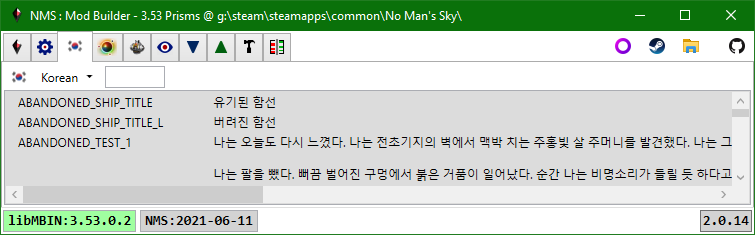
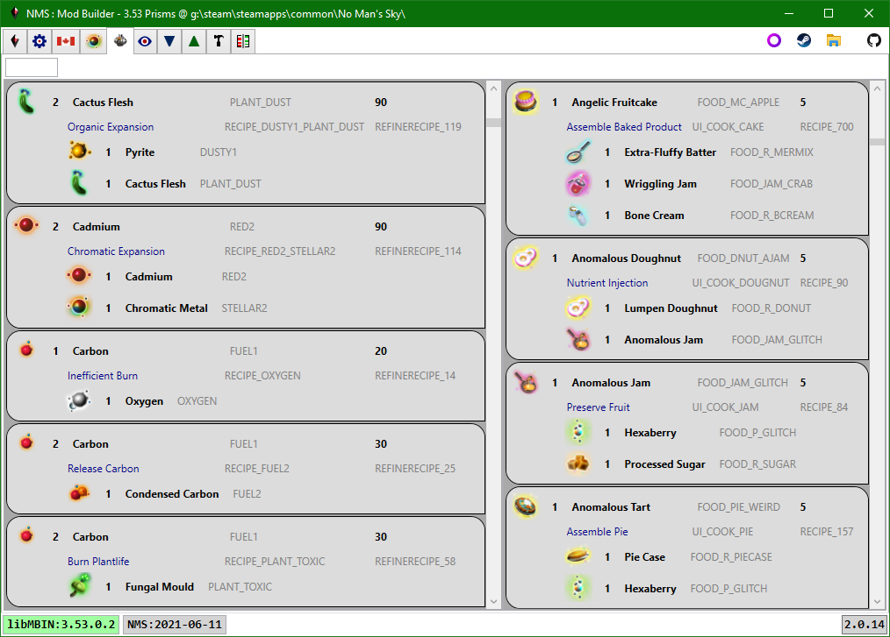
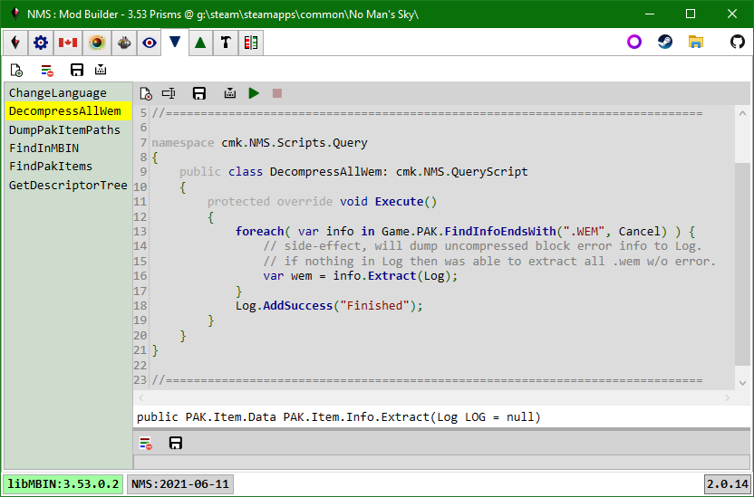
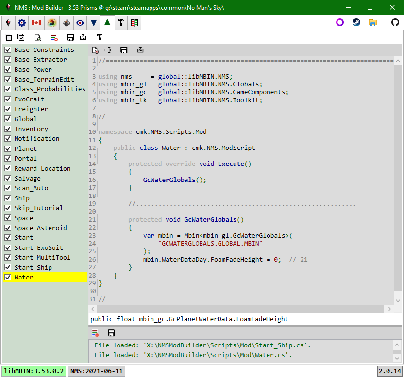

# NMS Mod Builder
> Fully functional alpha releases available, no code available until beta.

No Man's Sky Mod Builder. 
A one-stop solution for creating NMS mods using C#:
 
 

## Features
- Automatically detects normally installed Steam and GoG game instances.
  - Optionally select game instance using folder browser dialog, for non-standard installs.
- View MBINCompiler | libMBIN Enums, Classes, Fields.
- Select NMS language to view all language ID's and their localized values.
- View all substances, products, and technologies - ID, icon, localized names.
- View all refiner and cooking recipes - ID's, icons, localized names.
- View all game and mod pak items without having to unpack or decompile anything - it's all done on-demand in-memory.
- Use C# to create query scripts that search game and mod pak items.
- Use C# to create mod scripts that modify pak item data.
- Compile, select, and execute mod scripts to create modified pak items, save the modified pak items in new mod pak files.
- Side-by-side views of game & mod pak items, with built-in differ for text-based views.
- Most lists can be filtered using Regex expressions.
- Includes a number of query and mod scripts to get you started.
 
 

## Install
There is no installer; simply unzip the release file into a folder. 
The application does not save any app state, everything is reloaded on start.

### Dependencies
- Windows 10
- .NET Desktop Runtime 5.0.7+:  https://dotnet.microsoft.com/download/dotnet/5.0
- Other dependencies are bundled in the Release asset (.7z file).
 
 

## Mod Viewer Application

> If at any point the app needs a specific MBINCompiler | libMBIN version, that isn't currently in the app folder, e.g. based on selected game instance or mbin you are trying to view, it will prompt to download the appropriate file from GitHub.

### Startup
> The cmkNMSReleases.txt file in the app folder binds game releases to MBINCompiler | libMBIN versions, you must update it as new game releases and MBINCompiler | libMBIN versions are released.

When the application starts it may take 1-3 seconds before the window is displayed.
During that time the app is loading and linking all enums, classes, and fields from the libMBIN.dll in the app folder,
and searching for installed Steam and GoG game instances.

Once the main window is displayed, select the game instance by clicking the GoG, Steam, or Select Folder button on the application toolbar.
It will take 6 - 15 sec to load the language, substance, product, technology, and recipe mbin files and index them.
You will only see the GoG or Steam button if the application found a corresponding installed instance of the game. 
The Application log window will update as tasks are started and completed.

**Whatever version of libMBIN.dll is in the app folder will dictate the game release you can mod.**
If you have multiple game instances, for different releases, then you will need to manually change libMBIN.dll to the appropriate version for the release you want to mod.
You do not need to do this for viewing mbins only modding them, it will prompt to download whatever it needs for viewing. 
If you load a game instance that is supported by the libMBIN.dll in the application folder, then the libMBIN version in the statusbar will have a green background - you can create mods for this game instance,
otherwise the background will be red and all tabs other than the application, libMBIN API, and PAK Items will be hidden. 

### Toolbar
To the right of the tabs is the application toolbar.
It contains the game selection buttons (GoG, Steam, Folder), and the GitHub button.
The GitHub button opens the project GitHub site in your browser.

### Statusbar
The statusbar shows: libMBIN.dll version in application folder (one link loaded by application),
the build date of the NMS.exe once a game instance is loaded, and on the right the version of the application.

The NMS.exe build date is used to determine the game release for Steam installs.
The cmkNMSReleases.txt file in the application folder contains the mappings between game release, NMS.exe build date, and the best libMBIN.dll version to use.
**cmkNMSReleases.txt should be updated as new game releases and libMBIN.dll versions are made available.**

Clicking the application version will check GitHub for a newer version, and prompt the user to download if one is found.
The user is responsible for unzipping and updating the application files.

### Tabs

#### Application
Currently displays the default log.
> In the future any app configuration settings would be placed here.

#### libMBIN API

First column: all enums on top, enum values for selected enum on bottom. 
Second column: all classes on top, all fields on bottom. 
Third column: fields for selected class, and classes that have a field that is based on the selected class. 

Selecting an enum will populate the enum value list, clear any selected field, and select the class that defines the enum. 
Selecting a field will select the class that defines the field. 
Selecting a class will clear any selected field. 
In all cases the third column data will be updated to reflect the selected class.

The lists can be filtered using the toolbar textbox.  The search text can use Regex or *, ? wildcards. 
Enums can be further filtered based on number of values they have.

#### Language

Selecting a language from the toolbar combobox will load all the corresponding language .mbin files from the game .pak files.
The language Id - localized string value dictionary is used to lookup display names for the substances, products, technologies, and recipe lists in the other tabs.

The search filter uses simple case-insensitive substring searches.

#### Substances, Products, Technologies

The displayed names and descriptions used localized strings from the currently selected language. 
The search filter uses simple case-insensitive substring searches.

#### Refiner & Cooking Recipes

The search filter uses simple case-insensitive substring searches.

#### PAK Items
First select the pak tree you wish to browse, by selecting an item from the pak combobox.
The pak combobox list: merged game paks (default - first blank item), individual mod paks, individual game paks.
Usually you will either select a mod pak (if you want to look at the changes it makes), or the merged game paks.

Once a pak item tree is specified you can use the breadcrumb control to pick a pak item. 
Once several pak items have been viewed you can use the Previous | Next buttons on the toolbar to move through recently viewed items. 
You can use the Copy button to copy the path string to the clipboard e.g. to paste into a script. 
You can use the Save button to save the current item to disk.  You can save items even if they don't have a viewer.

In this case we've loaded a pak item (.mbin) from the merged game pak tree.

In this case we've loaded a pak item (.mbin) from the Mod.pak tree.

##### Notable formats
###### .MBIN & .MBIN.PC
Mbin items are viewed using a custom text file format (.ebin), but can be saved to disk as .mbin (binary), .exml (xml), or the displayed .ebin (text) format.
The first line specifies the libMBIN version that was used to decompile the .mbin.
For mod .mbin's this is the version used to compile the .mbin.
For game .mbin's this is the version associated with the game instance release.

Background renderer for colour values:

Double-click a language, substance, product, or technology Id to put the language Id in the toolbar along with the localized string (if found):

Double-click a pak item path to view the item:
 
Note: will try to fix-up errors e.g. converts .png to .dds, .exml to .mbin, ... .

###### .SPV
Spv items are compiled Vulkan GLSL shaders.  The application uses spirv-cross.exe to decompile these to text for display:
 

###### .DDS
All images are stored in .dds format:
 

#### Query Scripts
Use C# to query information from the currently loaded game instance, in particular from its pak items.

The tab toolbar has buttons to: create a new script, clear all script logs, save all script edits to disk, compile all scripts. 
The script toolbar has buttons to: delete, rename, save, compile, execute, stop execute (only enabled while script running).

> Currently, you should only execute one script at a time.

#### Mod Scripts
Use C# to modify data for the currently loaded game instance, in particular its mbin's.

The tab toolbar has buttons to: select | deselect all scripts, create a new script, clear all script logs, save all script edits to disk, compile all scripts, build mod assembly (in-memory). 
The script toolbar has buttons to: delete, rename, save, compile.

#### Mod Builder
- use the mod assembly created in the Mod Scripts tab to execute mods and build a mod pak from resulting modified items.
- first execute.  if nothing happens the mod assembly didn't build check log for each mod script to find error(s).
- the build mod pak stream (in memory).  after this you can use last tab to preview side-by-side changes made to files.
- finally save mod pak to disk, will default to game MODS folder but can save anywhere.
- if saved in game MODS folder then mod will now appear in PAK Viewer tab pak combobox.

#### Mod Diffs
Before building and saving the mod pak, you can preview the changes that were made. 
Uses the same pak item viewer code used to view game and mod pak items, except here it is only viewing the modified pak items.
 
 

## Pak Viewer Application
> Will be removed in a future release.

Basically the PAK Items tab from the Mod Builder app. 
Exists as a legacy hold-over from the NMS PAK Viewer project: https://github.com/cmkushnir/NMSPakViewer
 
 

## Dependencies
- https://github.com/monkeyman192/MBINCompiler 
MBINCompiler|libMBIN decompiles mbin items to in-memory dom and exml text.

- https://github.com/icsharpcode/SharpZipLib 
SharpZipLib decompress pak item data.

- https://github.com/icsharpcode/AvalonEdit 
AvalonEdit view|edit entries that can be converted to text.

- https://github.com/dotnet/roslyn 
Microsoft .NET C# compiler used to compile C# scripts.

- https://github.com/nickbabcock/Pfim 
Pfim converts (many) .dds entries to bitmaps for viewing.

- https://github.com/mmanela/diffplex 
DiffPlex calculates diffferences between items with text viewers e.g. mbin, xml.

 
 
