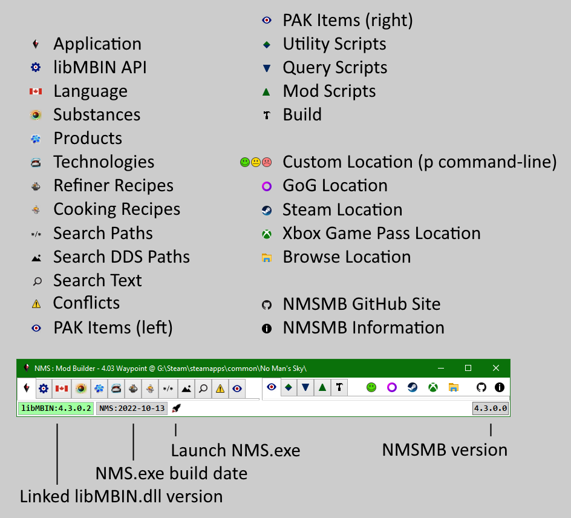

# NMS Mod Builder

## 
 >>> [Quick Start](Doc/QuickStart/Readme.md) <<< 

---

<!--ts-->
* [License](#License)
* [Install](#Install)
* [Configuration](#Configuration)
  * [libMBIN.dll](#libMBIN.dll)
  * [Command Line](#Command-Line)
  * [.editorconfig](#.editorconfig)
  * [cmkNMSReleases.txt](#cmkNMSReleases.txt)
  * [Plugins](#Plugins)
* [Startup](#Startup)
* [Tabs](Doc/Tab/Readme.md)
  * [Application](Doc/Tab/Application/Readme.md)
  * [libMBIN API](Doc/Tab/MBINC/Readme.md)
  * [Language](Doc/Tab/Language/Readme.md)
  * [Substances, Products, Technologies](Doc/Tab/Items/Readme.md)
  * [Refiner & Cooking Recipes](Doc/Tab/Recipes/Readme.md)
  * [Search Paths](Doc/Tab/SearchPaths/Readme.md)
  * [Search DDS Paths](Doc/Tab/SearchDds/Readme.md)
  * [Search Text](Doc/Tab/SearchText/Readme.md)
  * [PAK Conflicts](Doc/Tab/PakConflicts/Readme.md)
  * [PAK Items](Doc/Tab/PakItems/Readme.md)
  * [Scripts](Doc/Script/Readme.md)
    * [Utility Scripts](Doc/Tab/ScriptUtil/Readme.md)
    * [Query Scripts](Doc/Tab/ScriptQuery/Readme.md)
    * [Mod Scripts](Doc/Tab/ScriptMod/Readme.md)
  * [Build](Doc/Tab/Build/Readme.md)
* [Dependencies](#Dependencies)
<!--te-->

---

## License
All released items, including but not limited to: binaries, source files, documentation, are made available under the AGPL license,
with the additional provision that the released items may not be used to create forked or otherwise competing products.
A competing product would be one that can compile and execute .NET (e.g. C#) code at runtime to create modified game assets. 
> The additional provision may be removed once the Repository is Archived (i.e. development | maintenance is stopped).

---

## Install
Requires [.NET Desktop Runtime 6.x x64](https://dotnet.microsoft.com/download/dotnet/6.0) to be installed for versions greater than 3.82.1. 
Requires [.NET Desktop Runtime 5.x x64](https://dotnet.microsoft.com/download/dotnet/5.0) to be installed for versions up to 3.82.1. 

[Download the latest release](https://github.com/cmkushnir/NMSModBuilder/releases/latest/download/NMSModBuilder.7z), or select a [Release](https://github.com/cmkushnir/NMSModBuilder/releases) and download the corresponding NMSModBuilder.7z Asset. 
There is no installer, simply unzip the contents of NMSModBuilder.7z into a (new) folder. 

GitHub may have pre-release versions not uploaded to Nexus.
Versions are generally tagged as pre-release when a significant amount of code was added or changed.
The pre-relesae tag may be removed once they have been in-use for some period of time without any detected issues.

> When updating, remember to backup any bundled [Util](Doc/Tab/ScriptUtil/Readme.md), [Query](Doc/Tab/ScriptQuery/Readme.md), or [Mod](Doc/Tab/ScriptMod/Readme.md) scripts you may have modified, before overwritting them with those from a newer Release.

---

## Configuration
NMSMB should be able to run without the user having to make any configuration changes. 
You may need to replace the included libmbin.dll with the one required by the game release you want to load.

### libMBIN.dll
When NMSMB starts it loads the libMBIN.dll in the NMSMB folder.
It uses it for most of the research tabs, to display the contents of various mbin's e.g. languages.
It is also used by the scripts when they Extract or Create mbin's.
As such, the version of the libMBIN.dll in the NMSMB folder must match the one required by the game release you want to mod.
The [cmkNMSReleases.txt](https://github.com/cmkushnir/NMSModBuilder/blob/main/Common/cmkNMSReleases.txt) file lists what libMBIN.dll version is required for each game release.

If you have multiple game instances you want to mod, each requiring a different libMBIN.dll version, the easiest option is to create a NMSMB install folder for each game instance, each with the appropriate libMBIN.dll version;
otherwise you will have to manually make sure the correct libMBIN.dll version is in the NMSMB folder before modding a given game instance.

>The app may download other versions of libmbin e.g. libmbin_3.9.0.1.dll.
>They are ONLY used when decompiling mbin's.
>They are NOT used when starting the app, to load the research tabs, or when compiling|running scripts.

>A given NMSMB version can only roll the libmbin.dll version forward.
>For example, NMSMB version 4.0.0.0 comes with libmbin 4.0.0.2,
>you can only try to replace the included libmbin with newer versions like 4.0.0.3,
>you can not use older versions like 4.0.0.1.
>If your game release needs an older libmin then you need to use an older NMSMB version that supports it.
>Look in the NMSMB change.log to see what libmbin version is included with each NMSMB version,
>or just check the libmbin in the download file.

### Command-Line

#### `no_github`
Prevent NMSMB from connecting to GitHub. 
By default NMSMB will connect to GitHub to get:
- A copy of the current [cmkNMSReleases.txt](https://github.com/cmkushnir/NMSModBuilder/blob/main/Common/cmkNMSReleases.txt) when the application starts.
  It will merge those entries with the ones loaded from the local cmkNMSReleases.txt in the NMSMB folder.
  As long as the GitHub version is maintained, this should alleviate the need for the user to update their local cmkNMSReleases.txt.
  Note that the entries are only merged in-memory, the local cmkNMSReleases.txt is not updated.
- A list of all NMSMB releases when the user clicks the NMSMB version button in the statusbar.
  The list is only retrieved once per NMSMB run and cached in-memory.
- A list of all MBINCompiler | libMBIN releases the first time NMSMB needs to use a libMBIN.dll version other than the one in the NMSMB folder.
  e.g. when trying to view a mod mbin item compiled with an older MBINC version.
  The list is only retrieved once per NMSMB run and cached in-memory.

#### `no_registry`
Prevent NMSMB from storing window state in the registry when it closes and restoring it from the registry when it starts. 
NMSMB stores window state in **HKCU\SOFTWARE\cmkushnir\NMSMB\Windows**.
>The user is responsible for deleting the registry information if they remove NMSMB, there is no uninstaller.
>Note that if you use multiple NMSMB copies they all share the same registry key.

#### `p"path"`
Add a single game location to the toolbar.
A button will be added to the left of the GoG, Steam, Select buttons.

#### `r#.#.#`
Force the game release for the `p` game instance.
Only used if `p` also specified.
Ignored if `v` specified. 

#### `v#.#.#.#`
Force the MBINC version for the `p` game instance.
Only used if `p` also specified.
Overrides `r`.

#### `lg`, `ls`, `lx`, or `lp`
Try to auto-load a game instance on start (GoG, Steam, Xbox Game Pass, or `p` location).

>If `p` specified but neither `r` or `v` are specified, then will lookup the build date of the NMS.exe in cmkNMSReleases.txt to determine the release.

### .editorconfig
The .editorconfig file, in the NMSMB folder, is used by the script Format toolbar button to control things like indentation and spacing.

### cmkNMSReleases.txt
The cmkNMSReleases.txt file, in the NMSMB folder, binds game releases to MBINCompiler | libMBIN versions.
It is generally updated when new game releases and|or MBINCompiler | libMBIN versions are released | installed. 

NMSMB will automatically merge the entries from the local file with the latest entries from the [GitHub file](https://github.com/cmkushnir/NMSModBuilder/blob/main/Common/cmkNMSReleases.txt) when started,
unless the [**no_github**](#no_github) command-line option is specified.
This means the user should generally not need to edit this file as long as the [GitHub file](https://github.com/cmkushnir/NMSModBuilder/blob/main/Common/cmkNMSReleases.txt) is kept up-to-date.

The NMS.exe build date for a given game release can be different for each platform, including GoG vs Steam.
The NMS.exe build date may be a couple days before the official release date.
The cmkNMSReleases.txt build dates should correspond to the Steam NMS.exe build dates.

> You will only be able to create mods for game releases supported by the libMBIN.dll version in the NMSMB folder, as specified in cmkNMSReleases.txt.

### Plugins
A plugin dll is a .NET core dll that simply references cmkNMSCommon.dll and cmkNMSModBuilder.exe, and has a class derived from cmk.NMS.ModBuilder.Plugin.
When NMSMB starts it will load all ./Plugins/*.dll files.
For each dll it will create an instance of the first cmk.NMS.ModBuilder.Plugin derived class it finds and call its Load() method.
When NMSMB closes it will call the Unload() method for all Plugin instances.

Plugins can be used for things like:
- add classes and methods that can be used by the scripts.
- add or replace Data | Viewer | Differ classes for pak item types.
- add custom Viewer | Differ classes for top-level mbin classes.
- add or replace UI tabs.
- interface with another applications.

See: Plugins/Sample/ in the Repository.  

---

## Startup
Run cmkNMSModBuilder.exe with any desired command-line options, e.g.: 
`X:\Games\NMS\Tools\NMSModBuilder>cmkNMSModBuilder.exe p"G:\Games\No Man's Sky" lp`

When NMSMB starts it may take 1-3 seconds before the window is displayed.
During that time NMSMB is loading and linking all enums, classes, and fields from the libMBIN.dll in the NMSMB folder,
searching for installed GoG, Steam, and Xbox Game Pass game instances, loading any ./Plugins/*.dll files, ... .

### [Application](Doc/Tab/Application/Readme.md)
Default log window and NMSMB state toggle buttons.

### [libMBIN API](Doc/Tab/MBINC/Readme.md)
All Enums, Structs, Fields from linked libMBIN.dll. 
Top-level structs have links to mbin's that use them. 
Can filter displayed items using wildcard or regex pattern.

### [Language](Doc/Tab/Language/Readme.md)
Consolidated and sorted list of all ID - Text pairs for the selected language. 
The selected language is used to display Text in all tabs that use a language ID. 
Can filter displayed items using wildcard or regex pattern.

### [Substances, Products, Technologies](Doc/Tab/Items/Readme.md)
List items from corresponding `METADATA/REALITY/TABLES/*.MBIN`. 
For each item display Icon, ID's, Text, Description, Requirements. 
Can filter displayed items using wildcard or regex pattern.

### [Refiner and Cooking Recipes](Doc/Tab/Recipes/Readme.md)
List items from `METADATA/REALITY/TABLES/NMS_REALITY_GCRECIPETABLE.MBIN`. 
For each item display Icons, ID's, Text, Description, Requirements. 
Can filter displayed items using wildcard or regex pattern.

### [Search Paths](Doc/Tab/SearchPaths/Readme.md)
Use wildcard or regex pattern to search all item paths in game or mod pak files.

### [Search DDS Paths](Doc/Tab/SearchDds/Readme.md)
Use wildcard or regex pattern to search all *.dds paths in game or mod pak files. 
A thumbnail image is displayed for each result.

### [Search Text](Doc/Tab/SearchText)
Use wildcard or regex pattern to search items in game or mod pak files that can be represented as text. 
Optionally cache mbin text to significantly speed up subsequent searches.

### [PAK Conflicts](Doc/Tah/PakConflicts/Readme.md)
Only displayed if conflicts are detected. 
NMSMB watches the selected game `GAMEDATA/PCBANKS/MODS/` folder for *.pak adds | deletes | changes.
Whenever a change is detected it rechecks for conflicts, and displays the tab if any are found, otherwise it hides the tab.

### [PAK Items](Doc/Tab/PakItems/Readme.md)
View items in game or mod pak files.  Can save items to disk. 
Specialized viewers and diff viewers for common item types e.g. mbin, dds, spv, txt, ... .

### [Scripts](Doc/Script/Readme.md)
#### [Utility Scripts](Doc/Tab/ScriptUtil/Readme.md)
Create, edit, compile C# scripts that can be used by Query and Mod scripts.

#### [Query Scripts](Doc/Tab/ScriptQuery/Readme.md)
Create, edit, compile, execute C# scripts that can query data from game and mod pak files.

#### [Mod Scripts](Doc/Tab/ScriptMod/Readme.md)
Create, edit, compile C# scripts that create modified copies of game and installed mod pak files.

### [Build](Doc/Tab/Build/Readme.md)
Execute Mod script objects, use resulting modified items to Build new mod pak files.

### Custom Location
Only displayed if a valid `p` command-line path is specified.
- **Green:** can mod, the linked libMBIN.dll matches the NMS.exe version.
- **Yellow:** can mod, but GitHub disabled
- **Red:** can't mod, can only view pak items

### GoG Location
Checks registry for `HKEY_LOCAL_MACHINE\SOFTWARE\WOW6432Node\GOG.com\Games\1446213994\`. 
The registry key contains the install path and the game release.

### Steam Location
Searches all Steam game install locations for `appmanifest_275850.acf`. 
Manifest contains install path, game release from cmkNMSReleases.txt based on NMS.exe build date.

### Xbox Game Pass Location
Uses Windows package manager to look for pack ID `HelloGames.NoMansSky`. 
Package contains both install path and game release.

### Select | Browse Location
Selecting a valid game path will display the NMS.exe build date and matching game release from cmkNMSReleases.txt.
The user can override the game release.
 

### NMSMB GitHub Site
https://github.com/cmkushnir/NMSModBuilder

Note: user contributed scripts and documents can be found at: 
https://github.com/cmkushnir/NMSModBuilderContrib

### NMSMB Information
Display splash screen and links to dependencies.

### Linked libMBIN.dll version
- **Green:** can mod, the linked libMBIN.dll matches the selected NMS.exe version.
- **Yellow:** can mod, but GitHub disabled
- **Red:** can't mod, can only view pak items

The version of the link loaded libMBIN.dll in the NMSMB folder determines what game releases can be modded.
It does not control what mbin versions can be viewed, NMSMB will prompt to download the appropriate libMBIN.dll it needs to view a given mbin as needed.

### NMS.exe build date
The build date is stored in NMS.exe, so the file needs to be readable. 
Xbox Game Pass NMS.exe cannot be read by default, the date is from cmkNMSReleases.txt based on the game release.

### Launch NMS.exe
Minimize the NMSMB window and launch the selected NMS.exe in a new process.

### NMSMB version
Clicking this button will query GitHub for latest release.
User will be prompted to download NMSModBuilder.7z is a newer release is available.

### Note

Like libMBIN.dll, NMSMB does not attempt to be backwards compatible, so only libMBIN.dll versions released around the same time as the given NMSMB version may be supported for modding
i.e. earlier and later libMBIN.dll versions may change some classes that are directly used by NMSMB (NMSString*, serialize methods namespaces and signatures, language, substance, product, technology, recipe mbin's).

---

## Download

There are two times NMSMB may prompt you to download a file:
1) You try to view an mbin that was built using a version of libMBIN that isn't in the NMSMB folder.
2) You click the NMSMB version button, in the bottom-right of the statusbar, and a newer NMSMB version is available on GitHub.

---

## Dependencies

- https://github.com/cmkushnir/NMSModBuilderContrib 
User contributions e.g. scripts, plugins, doc's, ...

- https://github.com/monkeyman192/MBINCompiler 
Decompile and recompile *.mbin items to | from in-memory dom, and text.

- https://github.com/dotnet/roslyn 
Microsoft .NET compiler, used to compile C# scripts.

- https://github.com/icsharpcode/AvalonEdit 
View and edit items that can be converted to text.

- https://github.com/nickbabcock/Pfim 
Convert *.dds to bitmaps for viewing.

- https://github.com/KhronosGroup/SPIRV-Cross 
Convert *.spv to | from glsl text.

- https://github.com/mellinoe/veldrid-spirv 
Convert *.spv to | from glsl text.

- https://github.com/mmanela/diffplex 
Determine differences between text items.

- https://github.com/octokit/octokit.net 
Query GitHub for release information.

---
