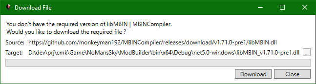
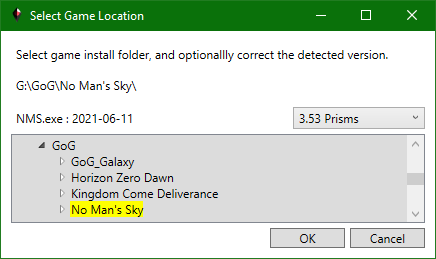
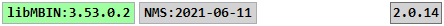

# NMS Mod Builder

No Man's Sky Mod Builder.

A one-stop solution for creating NMS mods using C#: 
- Automatically detects normally installed Steam and GoG game instances.
  - Optionally select game instance using folder browser dialog, for non-standard installs.
- View MBINCompiler | libMBIN Enums, Classes, Fields.
- Select NMS language to view all language ID's and their localized values.
- View all substances, products, and technologies - ID, icon, localized names.
- View all refiner and cooking recipes - ID's, icons, localized names.
- View all game and mod pak items without having to unpack or decompile anything - it's all done on-demand in-memory.
- Specialized viewers for common pak item types e.g. .mbin, .dds, .xml, .cs, .lua, ... .
- Side-by-side views of game & mod pak items, with built-in differ for text-based views.
- Use C# to create query scripts that search game and mod pak items.
- Use C# to create mod scripts that modify pak item data.
- Compile, select, and execute mod scripts to create modified pak items, save the modified pak items in new mod pak files.
- Includes a number of query and mod scripts to get you started.

 

## Contents
<!--ts-->
* [Install]
* [Startup]
* [Toolbar]
* [Statusbar]
* Tabs
  * [Application](Doc/Tab_Application.md)
  * [libMBIN API](Doc/Tab_libMBIN.md)
  * [Language](Doc/Tab_Language.md)
  * [Substances, Products, Technologies](Doc/Tab_GameItems.md)
  * [Refiner & Cooking Recipes](Doc/Tab_GameRecipes.md)
  * [PAK Items](Doc/Tab_PakItems.md)
  * [Query Scripts](Doc/Tab_QueryScripts.md)
  * [Mod Scripts](Doc/Tab_ModScripts.md)
  * [Mod Builder](Doc/Tab_ModBuilder.md)
  * [Mod Diffs](Doc/Tab_ModDiffs.md)
* [Script API](Doc/Script_API.md)
* [Dependencies]
<!--te-->

 
 

## Install
Make sure [.NET Desktop Runtime 5.0.7](https://dotnet.microsoft.com/download/dotnet/5.0) or greater is installed. 
Download the latest [Release](https://github.com/cmkushnir/NMSModBuilder/releases/latest/download/NMSModBuilder.7z), or choose a Release from [Releases](https://github.com/cmkushnir/NMSModBuilder/releases). 
There is no installer; simply unzip the Release file into a folder. 
The app has no configuration.

> When updating, remember to backup any app scripts you may have modified before overwritting them with those in a newer Release file.

 
 

### Startup
> The cmkNMSReleases.txt file in the app folder binds game releases to MBINCompiler | libMBIN versions, you must update it when new game releases and|or MBINCompiler | libMBIN versions are installed.

> You will only be able to create mods for game releases supported by the libMBIN.dll version in the app folder, as specified in cmkNMSReleases.txt.

Run cmkNMSModBuilder.exe.

When the app starts it may take 1-3 seconds before the window is displayed.
During that time the app is loading and linking all enums, classes, and fields from the libMBIN.dll in the app folder,
and searching for installed Steam and GoG game instances.

You will only see the GoG or Steam button if the app found a corresponding installed instance of the game.

Once the main window is displayed, select the game instance by clicking the GoG, Steam, or Select Folder button on the application [toolbar](Doc/cmkNMSModBuilder#Toolbar)).
It will take 6 - 15 sec to load and index the language, substance, product, technology, and recipe mbin files.
The [Application tab](Doc/Tab_Application.md) log window will update as tasks are started and completed.

If you have multiple game instances, for different releases, then you will need to manually change libMBIN.dll to the appropriate version for the release you want to mod.
You do not need to do this for viewing mbins only modding them, it will prompt to download whatever it needs for viewing.

 

### Toolbar

To the right of the tabs is the application toolbar.
It contains the game selection buttons (GoG, Steam, Folder), and the GitHub button.
The GitHub button opens the project GitHub site in your browser.

If you use the Select Folder button the following dialog will open: 
 
Selecting a valid game folder will display the build date of the NMS.exe and the best guess of the game release.
If the selected path matches a discovered GoG or Steam install path, then any pre-loaded GoG or Steam game instance data will be used i.e. you cannot load two instances of the same game instance.

Since there is no official way to determine the game release from an installed instance, the application does the following:
- For GoG, the release information is embedded in a string in the registry.
- For Steam, the release is looked up in cmkNMSReleases.txt based on the NMS.exe build date.
- For Selected Folders, the release is looked up in cmkNMSReleases.txt based on the NMS.exe build date, but the user can override by selecting a different release in the Select Game Location dialog.

> The NMS.exe build date for a given game release can be different for each platform, including GoG vs Steam.
> The NMS.exe build date may be a couple days before the official release date.
> The cmkNMSReleases.txt build dates should correspond to the Steam NMS.exe build dates.

 

### Statusbar

The statusbar shows: version of libMBIN.dll in application folder (one link loaded by application),
the build date of the NMS.exe (once a game instance is loaded), and on the right the app version.

If you load a game instance that is supported by the libMBIN.dll in the app folder, then the libMBIN version in the statusbar will have a green background - you can create mods for this game instance,
otherwise the background will be red and all tabs other than Application, libMBIN API, and PAK Items will be hidden. 

Clicking the app version will check GitHub for a newer version, and prompt the user to download if one is found.
The user is responsible for unzipping and updating the app files.

 
 

## Dependencies

- https://github.com/monkeyman192/MBINCompiler 
MBINCompiler | libMBIN decompiles|recompiles mbin items to|from in-memory dom and exml text.

- https://github.com/dotnet/roslyn 
Microsoft .NET C# compiler, used to compile C# scripts.

- https://github.com/icsharpcode/AvalonEdit 
AvalonEdit view|edit items that can be converted to text.

- https://github.com/icsharpcode/SharpZipLib 
SharpZipLib decompress pak item data.

- https://github.com/nickbabcock/Pfim 
Pfim converts (most) .dds items to bitmaps for viewing.

- https://github.com/mmanela/diffplex 
DiffPlex calculates diffferences between items that can be converted to text.

 
