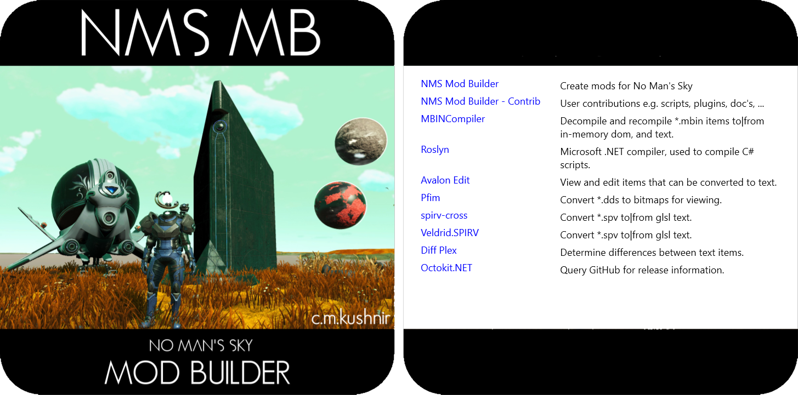

# NMS Mod Builder

 

<!--ts-->
* [Features](#Features)
* [License](#License)
* [Install](#Install)
* [Configuration](#Configuration)
  * [cmkNMSReleases.txt](#cmkNMSReleases.txt)
  * [Command Line](#Command-Line)
* [Startup](#Startup)
  * [Plugins](#Plugins)
  * [Toolbar](#Toolbar)
  * [Statusbar](#Statusbar)
  * [Download](#Download)
  * [Loading](#Loading)
* [Tabs](Doc/Tab/Tabs.md)
  * [Application](Doc/Tab/Application/Application.md)
  * [libMBIN API](Doc/Tab/MBINC/MBINC.md)
  * [Language](Doc/Tab/Language/Language.md)
  * [DDS](Doc/Tab/Dds/Dds.md)
  * [Substances, Products, Technologies](Doc/Tab/Items/Items.md)
  * [Refiner & Cooking Recipes](Doc/Tab/Recipes/Recipes.md)
  * [PAK Conflicts](Doc/Tab/PakConflicts/PakConflicts.md)
  * [PAK Items](Doc/Tab/PakItems/PakItems.md)
  * [Query Scripts](Doc/Tab/ScriptQuery/ScriptQuery.md)
  * [Mod Scripts](Doc/Tab/ScriptMod/ScriptMod.md)
  * [Build](Doc/Tab/Build/Build.md)
* [Dependencies](#Dependencies)
<!--te-->

 
 

## Features
A one-stop solution for creating NMS mods using C# 
- Automatically detects normally installed GoG and Steam game instances.
  - Optionally select game instance using folder browser dialog, for non-standard installs.
  - Optionally specify a custom install location via the command-line to have a toolbar button added for it.
- View MBINCompiler | libMBIN Enums, Classes, Fields.
- Select NMS language to view all language ID's and their localized values.
- Search for DDS image paths, in the game pak files, using wildcards 
- View all substances, products, and technologies - ID, icon, localized names.
- View all refiner and cooking recipes - ID's, icons, localized names.
- Auto-generates list of conflicts between PCBANKS/MODS/*.pak files.
- View all game and mod pak items without having to unpack or decompile anything - it's all done in-memory on-demand.
  - Specialized viewers for common pak item types e.g. .mbin, .dds, .xml, .cs, .lua, ... .
  - Side-by-side views of game & mod pak items, with built-in differ for text-based views.
- Use C# to create query scripts that search game and mod pak items.
- Use C# to create mod scripts that modify pak items, create new mod pak files from the modified pak items.
- Includes a number of query and mod scripts to get you started.

 
 

## License
All released items, including but not limited to: binaries, source files, documentation, are made available under the AGPL license,
with the additional provision that the released items may not be used to create forked or otherwise competing products.
A competing product would be one that can compile and execute .NET (e.g. C#) code at runtime to create modified game assets. 
> The additional provision will be removed once the Repository is Archived (i.e. development|maintenance is stopped).

 
 

## Install
Requires [.NET Desktop Runtime 5.x x64](https://dotnet.microsoft.com/download/dotnet/5.0) to be installed for versions up to 3.82.1. 
Requires [.NET Desktop Runtime 6.x x64](https://dotnet.microsoft.com/download/dotnet/6.0) to be installed for versions 3.82.2.2 onwards. 
Select a [Release](https://github.com/cmkushnir/NMSModBuilder/releases) and download the corresponding NMSModBuilder.7z Asset. 
There is no installer, simply unzip the contents of NMSModBuilder.7z into a (new) folder. 

> When updating, remember to backup any bundled [Query Scripts](Doc/Scripts/Query/Query.md) or [Mod Scripts](Doc/Scripts/Mod/Mod.md) you may have modified, before overwritting them with those from a newer Release.

 
 

## Public Contributions
User contributed c# scripts and plugins can be found [here](https://github.com/cmkushnir/NMSModBuilderContrib). 

 
 

## Configuration
The application should be able to run without the user having to make any configuration changes. 

 

### cmkNMSReleases.txt
The cmkNMSReleases.txt file in the application folder binds game releases to MBINCompiler | libMBIN versions.
It is generally updated when new game releases and|or MBINCompiler | libMBIN versions are installed. 
The application will automatically merge the entries from the local file with the latest entries from the GitHub file when started,
unless the **no_github** command-line option is specified.  This means the user should generally not need to edit this file as long as the GitHub file is kept up-to-date.

> You will only be able to create mods for game releases supported by the libMBIN.dll version in the application folder, as specified in cmkNMSReleases.txt.

 

### Command-Line

#### no_split_tabs
Force the application to start with a single set of tabs. 
By default the application will start with [split-tabs](Doc/Tab/Tabs.md). 
Legacy support, may be removed in future releases.

#### no_github
Prevent the application from connecting to GitHub. 
By default the application will connect to GitHub to get:
- A copy of the latest cmkNMSReleases.txt when the application starts.
  It will merge those entries with the ones loaded from the local cmkNMSReleases.txt in the application folder.
  As long as the GitHub version is maintained, this should alleviate the need for the user to update their local cmkNMSReleases.txt.
  Note that the entries are only merged in-memory, the local cmkNMSReleases.txt is not updated.
- A list of all releases for the application when the user clicks the application version button in the statusbar.
  The list is only retrieved once per application run and cached in-memory.
- A list of all MBINCompiler releases the first time the application needs to use a libMBIN.dll version other than the one in the application folder.
  e.g. when trying to view a mod mbin item compiled with an older MBINC version.
  The list is only retrieved once per application run and cached in-memory.

#### no_persist_ui
Prevent the application from storing window state in the registry when it closes and restoring it from the registry when it starts. 
By default the application will store window state in **HKCU\SOFTWARE\cmkushnir\NMSMB\Windows**.
Note that the user is responsible for deleting the registry information if they remove the application, there is no uninstaller. 

#### -p"path"
Add a single game location to the toolbar.  A button will be added to the left of the GoG, Steam, Select buttons.

#### -r#.#.#
Force the game release for the -p game instance.  Only used if -p also specified.  Ignored if -v specified. 

#### -v#.#.#.#
Force the MBINC version for the -p game instance.  Only used if -p also specified.  Overrides -r.

If -p specified but neither -r or -v are specified, then will lookup the build date of the NMS.exe in cmkNMSReleases.txt to determine the release.

 
 

## Startup
> If you have multiple game instances that require different libMBIN.dll versions, then you will need to manually change libMBIN.dll to the appropriate version for the Release you want to mod.
> You do not need to do this for viewing mbins only modding them, it will prompt to download whatever it needs for viewing. 
> Note that like libMBIN.dll, the application does not attempt to be backwards compatible, so only libMBIN.dll versions released around the same time as the application may be supported for modding
> i.e. earlier and later libMBIN.dll versions may change some classes that are directly used by the application (NMSString*, serialize methods namespaces and signatures, language, substance, product, technology, recipe mbin's).

Run cmkNMSModBuilder.exe with any desired command-line options, e.g.: 
_X:\Games\NMS\Tools\cmk\NMSModBuilder>cmkNMSModBuilder.exe -p"G:\Games\No Man's Sky"_

When the application starts it may take 1-3 seconds before the window is displayed.
During that time the application is loading and linking all enums, classes, and fields from the libMBIN.dll in the application folder,
searching for installed Steam and GoG game instances, loading any ./Plugins/*.dll files.

 

### Plugins

A plugin dll simply references cmkNMSCommon.dll and cmkNMSModBuilder.exe, and has a class derived from cmk.NMS.ModBuilder.Plugin.
When the application starts it will load all ./Plugins/*.dll files.
For each dll it will create an instance of the first cmk.NMS.ModBuilder.Plugin derived class it finds and call its Load() method.
When the application closes it will call the Unload() method for all Plugin instances.

Plugins can be used for things like:
- add classes and methods that can be used by the scripts.
- add or replace Data|Viewer|Differ classes for pak item types.
- add custom Viewer|Differ classes for top-level mbin classes.
- add or replace UI tabs.
- interface with another applications.

See: Plugins/Sample/ in the Repository.  

 

### Toolbar

- **Command-line -p game instance:**  Green - can mod, Yellow - can mod but GitHub disabled, Red - can't mod, only view pak items.  Only displayed if -p command-line path is for a valid game instance.
- **GoG game instance:**  Only displayed if found a GoG game instance.
- **Steam game instance:**  Only displayed if found a Steam game instance.  If multiple Steam accounts only first found is used.
- **Select game instance:**  Opens dialog to select game instance folder.
- **GitHub project:**  Open application project page in default browser.
- **Application information:**  Open dialog with links to other GitHub projects used by application.

Select game instance dialog: 
 
Selecting a valid game folder will display the build date of the NMS.exe and the best guess of the game release.
If the selected path matches a discovered GoG or Steam install path, then any pre-loaded GoG or Steam game instance data will be used
i.e. you cannot load two instances of the same game instance (uses path to determine if game instances are the same, may load same instance if reachable through different paths e.g. hard|sym links).

 

Since there is no official way to determine the game release from an installed instance, the application does the following:
- **GoG:** Release information is extracted from a string in the registry. 
  e.g. 3.53 is extracted from Computer\HKEY_LOCAL_MACHINE\SOFTWARE\WOW6432Node\GOG.com\Games\1446213994\ver = "3.53_Prisms_73811"
- **Steam:** Release is looked up in cmkNMSReleases.txt based on the NMS.exe build date.
- **Selected Folders:** Release is looked up in cmkNMSReleases.txt based on the NMS.exe build date, but the user can override by selecting a different release in the Select Game Location dialog.

> The NMS.exe build date for a given game release can be different for each platform, including GoG vs Steam.
> The NMS.exe build date may be a couple days before the official release date.
> The cmkNMSReleases.txt build dates should correspond to the Steam NMS.exe build dates.

 

### Statusbar

- Version of libMBIN.dll in application folder (one link loaded by application).
  Green - can mod, Yellow - can mod but GitHub disabled, Red - can't mod, only view pak items.
- Build date of the current game instance NMS.exe.
- Application version.  When clicked will check GitHub for a newer version,
  and prompt the user to download if one is found.
  The user is responsible for unzipping and updating the application files from the downloaded file.

 

### Download

There are two times the application may prompt you to download a file:
1) You try to view an mbin that was built using a version of libMBIN that isn't in the application folder.
2) You click the application version button, in the bottom-right of the statusbar, and a newer application version is available on GitHub.

 

### Loading

Once the main window is displayed, select the game instance by clicking the Custom, GoG, Steam, or Select Folder button on the application toolbar.
It will take 8 - 15 sec to load and index the various pak files.
The [Application tab](Doc/Tab/Application/Application.md) log window will update as tasks are started and completed.

- **Loading Types from ... :**
  Each game instance gets it's own wrapper around the linked libMBIN.dll.
  This allows different game instances that use the same libMBIN.dll version, but may have different mbin's,
  to display the game instance specific mbins in the [libMBIN API tab](Doc/Tab/MBINC/MBINC.md).
  So even though it already did this at the application level, it needs to do it again per game instance.
- **Loading item info from ... :**
  Load meta-data for each pak file in the PCBANKS and PCBANKS/MODS folders.
  - Load each pak header and manifest.
    Pak item Info objects are created for each manifest entry.
    The Info objects contain the item Path and meta-data required to extract the item Data.
    Each pak file wrapper maintains both a sorted list and a tree of manifest Info objects.
  - Load the header for each pak mbin item.  Mainly used to get the top-level class for each mbin, so the mbin can be linked to the corresponding MBINC class.
- **Building merged item info tree from ... :**
  The game pak files (PCBANKS) have their Info lists added to a merged Info tree.
- **Linking MBIN paths to libMBIN classes:**
  Link the Path of each game pak mbin item to the top-level class in the game instance libMBIN wrapper.
- **Loading cmk.NMS.Game.Language.Collection:**
  Each supported language has Id - value pairs stored in 5 or more mbin's.
  This loads all the mbin's for the current language, and adds all Id - value pairs to a dictionary.
  The dictionary is displayed in the [Language tab](Doc/Tab/Language/Language.md).
  It is also used to map Game.Item Id's to localized strings.
- **Loading cmk.NMS.Game.Items.\*.Collection:**
  Load the corresponding mbin, create a wrapper for each item.
  The wrapper objects contain the Id's, localized strings, and bitmap versions of the icon.
  These collections are displayed in the [Substances, Products, Technologies tabs](Doc/Tab/Items/Items.md).
- **Loading cmk.NMS.Game.Recipes.\*.Collection:**
  Load the recipes mbin and create wrappers for each item.
  The wrapper objects contain the Id's, localized strings, and bitmap versions of the icon.
  These collections are displayed in the [Refiner & Cooking Recipes tabs](Doc/Tab/Recipes/Recipes.md).
- **Updated cmk.NMS.\*.Collection 'ENGLISH':**
  Whenever the current language is changed the Game.Items and Game.Recipes lists have their localized strings updated.
  It takes 1-2 seconds to load a different language.

The above tasks are done in parallel.
This means that having a processor that supports more concurrent threads will help keep the load time down.
It also means the load may become I/O limited, especially if the game files are on a hard-disk instead of an SSD.

 
 

## Dependencies

- https://github.com/monkeyman192/MBINCompiler 
MBINCompiler.exe | libMBIN.dll decompiles|recompiles .mbin items to|from in-memory dom and .exml text.

- https://github.com/dotnet/roslyn 
Microsoft .NET C# compiler, used to compile C# scripts.

- https://github.com/icsharpcode/AvalonEdit 
AvalonEdit view|edit items that can be converted to text.

- https://github.com/icsharpcode/SharpZipLib 
SharpZipLib decompress' *.pak item data.

- https://github.com/nickbabcock/Pfim 
Pfim converts (most) .dds items to bitmaps for viewing.

- https://github.com/mmanela/diffplex 
DiffPlex calculates differences between items that can be converted to text.

- https://github.com/octokit/octokit.net 
Octokit.NET provides access to GitHub to query application and MBINC release information.

 
